# Detailed Design Document (DDD): AI-Assisted URL Shortener

| Field | Value |
|---|---|
| Status | Draft v1.0, input to code generation |
| Source | `prd-url-shortener.md` (PRD v1.0, 2026-10-07) |
| Stack | Java 21 · Spring Boot 3.3.x (Web MVC) · PostgreSQL 16 in Docker · Flyway · Caffeine · springdoc-openapi |
| Audience | Engineers who generate, review and own the code, and the AI assistant helping them |
| Owner | The engineering lead owns this document and every decision in it. AI drafted it, and a human approved it. |

> **How to use this document for code generation.** §2 to §6 define *what* to build (components, schema, flows, API). §7 is a file-by-file build manifest in the order to generate it. §8 to §12 define *how* it is built, checked and approved. Requirement IDs (`URL-FR-x.y`, `URL-NFR-x.y`) come from the PRD and must appear in code comments on the main methods, and in test names, so there is end-to-end traceability.

---

## Table of Contents
1. [Plan, Rationale and Design Principles](#1-plan-rationale-and-design-principles)
2. [System Architecture (Block Diagram)](#2-system-architecture-block-diagram)
3. [Component Design](#3-component-design)
4. [PostgreSQL Data Model, Creation Script and Sample Data](#4-postgresql-data-model-creation-script-and-sample-data)
5. [API Contract](#5-api-contract)
6. [Core Sequence Flows (All Flows)](#6-core-sequence-flows-all-flows)
7. [Working Prototype: Project Layout, Config and Build Manifest](#7-working-prototype-project-layout-config-and-build-manifest)
8. [Testing Strategy](#8-testing-strategy)
9. [Quality Gates and Measurement of Quality](#9-quality-gates-and-measurement-of-quality)
10. [AI-Assisted Engineering Model](#10-ai-assisted-engineering-model)
11. [Scenarios: Greenfield, Brownfield, Ambiguous](#11-scenarios-greenfield-brownfield-ambiguous)
12. [Risk, Security and Operational Mitigations](#12-risk-security-and-operational-mitigations)
13. [Deployment and Infrastructure Notes](#13-deployment-and-infrastructure-notes)
14. [Product Timeline](#14-product-timeline)
15. [Artifacts](#15-artifacts)
16. [Assumptions, Limitations and Deviations from the PRD](#16-assumptions-limitations-and-deviations-from-the-prd)
17. [Appendix: Traceability Matrix](#17-appendix-traceability-matrix)

---

## 1. Plan, Rationale and Design Principles

### 1.1 Plan in one paragraph
Build a **single Spring Boot service** with a strictly layered package structure (API, service, repository, infrastructure) that talks to **one PostgreSQL database running in Docker**. The redirect hot path reads from an **in-process Caffeine cache** and falls back to Postgres. Click events go into a **bounded in-memory queue** and a scheduled worker writes them to Postgres in batches, so redirects never wait on analytics. Schema changes are versioned **Flyway** migrations, and demo data loads only under the `local` profile. Everything runs with `docker compose up -d postgres` followed by `./mvnw spring-boot:run`.

### 1.2 Key decisions and rationale

| # | Decision | Rationale | Alternative considered |
|---|---|---|---|
| D1 | Spring Boot Web MVC (blocking) on Java 21 **virtual threads** | Simple programming model. Virtual threads give high concurrency without reactive complexity. | WebFlux: more complex and harder to review |
| D2 | `JdbcClient` with hand-written SQL, no JPA | The SQL is explicit and reviewable, batch inserts are easy, there are no hidden queries, and it maps 1:1 to the DDL in §4 | Spring Data JPA: less transparent for batch analytics |
| D3 | Flyway migrations, `ddl-auto` never used | Versioned, reviewable schema changes. A human approves every migration (§10.5). | Hibernate auto-DDL: unsafe |
| D4 | **Caffeine in-process cache** instead of Redis for the prototype | The user asked for a simple app plus Postgres. A `LinkCache` interface keeps Redis as a drop-in later (§13.4). | Redis now: one more container and more failure modes for the demo |
| D5 | Click buffer = `ArrayBlockingQueue` + `@Scheduled` flush | Non-blocking `offer()` keeps the hot path fast, and loss is bounded and documented (NFR-3) | Kafka or a queue: out of scope for the prototype |
| D6 | `302` with `Cache-Control: private, no-cache, no-store` | Keeps clicks countable and lets deactivation take effect (PRD §7.1) | 301 |
| D7 | API keys stored as SHA-256 hex and looked up by hash | Keys are 128-bit random values, so an unsalted fast hash is enough. Raw keys are never stored or logged. | bcrypt: slow on every request, and not needed for high-entropy keys |
| D8 | Simple fixed-window rate limiter in Caffeine | Easy to read, with no extra dependency | Bucket4j: more features than needed |
| D9 | `java.time.Clock` injected everywhere | Expiry and stats logic can be tested deterministically | `Instant.now()`: flaky boundary tests |
| D10 | Database credentials ignored for local runs (`trust` auth) | Per user instruction. Listed as a limitation (§16.2). | `.env` secrets: next step |

### 1.3 Core engineering principles and how this design applies them

| Principle | Concrete mechanism in this design | How it is enforced |
|---|---|---|
| **Modular** | Four layers in separate packages. Service code never imports `jakarta.servlet` or `org.springframework.web`. | ArchUnit test `LayeringArchTest` (§8) |
| **Testable** | Pure service classes, injected `Clock`, interfaces at the boundaries (`LinkCache`, `ClickSink`) | Coverage of 85% or more on `service` (JaCoCo gate) |
| **Reliable** | Degrade instead of failing: cache errors fall back to the DB, and analytics errors drop clicks and record a metric. Graceful shutdown flushes the buffer. | Failure-injection tests |
| **Secure** | Hashed API keys, a URL scheme allowlist, self-redirect blocking, strict JSON, an 8 KB body limit, parameterised SQL, hashed IPs only, no stack traces in responses | Unit tests plus gitleaks, OWASP Dependency-Check and SpotBugs in CI |
| **Scalable** | Stateless app tier (no session state). The cache and rate limiter sit behind interfaces so they can be shared later. Indexed queries. | Documented scale path (§13.4) and k6 load test |
| **Safe change management** | Flyway migrations, one ticket per PR, branch protection, human sign-off for high-impact changes, ADRs | Branch protection rules, CODEOWNERS, PR template (§10) |

---

## 2. System Architecture (Block Diagram)

### 2.1 High-level layout

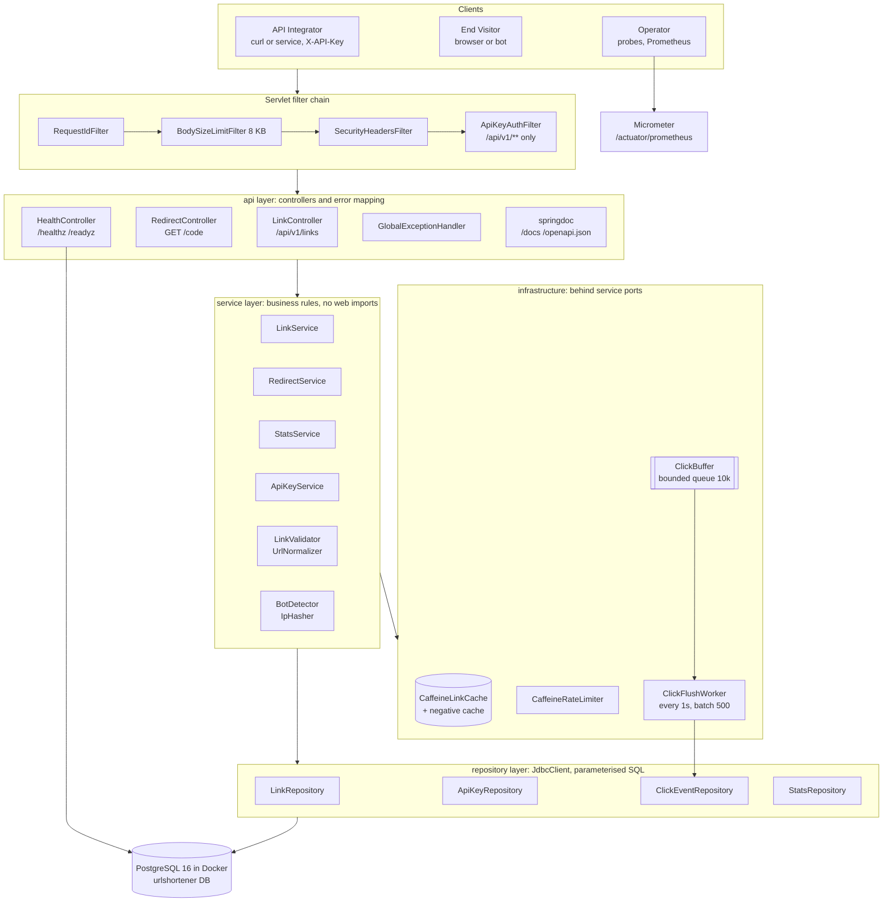

### 2.2 Request routing table

| Path pattern | Handler | Auth | Notes |
|---|---|---|---|
| `POST /api/v1/links` | `LinkController.create` | API key | Rate limit 60/min per key |
| `GET /api/v1/links/{code}` | `LinkController.get` | API key (owner) | |
| `DELETE /api/v1/links/{code}` | `LinkController.deactivate` | API key (owner) | Idempotent |
| `GET /api/v1/links/{code}/stats` | `LinkController.stats` | API key (owner) | `from`, `to` query params |
| `GET /healthz` | `HealthController.liveness` | Public | No dependency checks |
| `GET /readyz` | `HealthController.readiness` | Public | DB check only (no Redis, see §16.3) |
| `GET /docs`, `/openapi.json` | springdoc | Public | |
| `GET /actuator/prometheus` | Actuator | Public on local; restrict in shared environments | |
| `GET /{code:[A-Za-z0-9_-]{4,32}}` | `RedirectController.redirect` | Public | Rate limit 600/min per IP hash. Spring matches literal paths first, so system routes always win (R11). |

---

## 3. Component Design

### 3.1 Responsibilities

| Component | Layer | Responsibility | PRD IDs |
|---|---|---|---|
| `RequestIdFilter` | api | Reads `X-Request-Id` or generates a UUID, puts it in MDC and echoes it on the response | URL-OBS-1 |
| `BodySizeLimitFilter` | api | Rejects `Content-Length` over 8192 with 413 and chunked POST bodies with 411 | URL-NFR-4.5 |
| `SecurityHeadersFilter` | api | `X-Content-Type-Options: nosniff`, `Referrer-Policy: no-referrer` | URL-NFR-4.6 |
| `ApiKeyAuthFilter` | api | Applies to `/api/v1/**`: hashes the header, calls `ApiKeyService.authenticate`, sets the `AuthenticatedOwner` request attribute, returns 401 on failure | URL-NFR-4.1 |
| `LinkController` | api | DTO mapping only, no business rules | FR-1,2,4,5,6,7 |
| `RedirectController` | api | Extracts the client IP, `Referer` and `User-Agent`, calls `RedirectService`, writes the 302 with no-cache headers | FR-3 |
| `HealthController` | api | `/healthz` always returns 200. `/readyz` runs `SELECT 1` with a 1 s timeout and returns 200 or 503. | FR-8 |
| `GlobalExceptionHandler` | api | Maps `ApiException(ErrorCode)` and framework exceptions to the error envelope. Never includes stack traces. | URL-NFR-4.6 |
| `LinkService` | service | Create (validate, dedupe, generate or reserve code, insert, warm cache), get metadata, deactivate (soft delete, invalidate cache) | FR-1,2,4,5,6 |
| `RedirectService` | service | Rate-limit check, cache then negative cache then DB lookup, status evaluation, enqueue click | FR-3, FR-7.1/7.2 |
| `StatsService` | service | Validates the range, queries aggregates, zero-fills days | FR-7.5, 7.7 |
| `ApiKeyService` | service | SHA-256 hash, lookup, revoked check, 30 s positive-result cache | URL-NFR-4.1/4.2 |
| `LinkValidator` | service | URL, alias, reserved-word and expiry rules (§3.3) | FR-1.5, 2.1, 2.2, 4.2 |
| `UrlNormalizer` | service | Lowercases scheme and host, strips default port | PRD A5 |
| `BotDetector` | service | Case-insensitive regex list from config (`app.analytics.bot-patterns`, versioned) | FR-7.4 |
| `IpHasher` | service | `HMAC-SHA256(salt, ip)` as lowercase hex. The salt comes from config `app.analytics.ip-salt`. | FR-7.3 |
| `RateLimiter` | service (interface), infra (impl) | `tryAcquire(bucketKey, limitPerMinute)` returns `Allowed` or `Denied(retryAfterSeconds)` | URL-NFR-4.3, FR-3.7 |
| `LinkCache` | service (interface), infra (impl) | `get`, `put`, `evict`, `markMissing`, `isKnownMissing`, `clearMissing`. All methods swallow internal errors and record a metric (degrade, don't fail). | FR-3.4, 3.5, 3.6 |
| `ClickSink` | service (interface), infra (`ClickBuffer`) | `boolean offer(ClickEvent)`. It must never block. | FR-7.2 |
| `ClickFlushWorker` | infra | Every 1 s drains up to 500 events and writes them in a single transaction: batch insert plus per-link `click_count` increments. On SIGTERM it drains everything. | FR-7.2, 7.6, OBS-3 |
| `*Repository` | repository | Parameterised SQL through `JdbcClient` only | NFR-4.5 |

### 3.2 Domain model (Java records)

```java
// service.domain
enum LinkStatus { ACTIVE, INACTIVE }                 // persisted
enum EffectiveStatus { ACTIVE, INACTIVE, EXPIRED }   // derived at read time (URL-FR-4.3)

record Link(long id, String code, long ownerId, String targetUrl, String normalizedUrl,
            boolean customAlias, LinkStatus status, Instant createdAt, Instant expiresAt,
            Instant deactivatedAt, long clickCount) {
  EffectiveStatus effectiveStatus(Instant now) {
    if (status == LinkStatus.INACTIVE) return EffectiveStatus.INACTIVE;
    if (expiresAt != null && !now.isBefore(expiresAt)) return EffectiveStatus.EXPIRED;
    return EffectiveStatus.ACTIVE;
  }
}

record CachedLink(long linkId, String targetUrl, LinkStatus status, Instant expiresAt) {}

record ClickEvent(long linkId, Instant clickedAt, String referrerHost, String userAgent,
                  boolean bot, String ipHash, String country) {}

record AuthenticatedOwner(long ownerId, long apiKeyId) {}

sealed interface RedirectResult {
  record Found(String targetUrl) implements RedirectResult {}
  record NotFound() implements RedirectResult {}
  record Gone() implements RedirectResult {}
  record RateLimited(long retryAfterSeconds) implements RedirectResult {}
}
```

### 3.3 Validation rules (exact)

| Field | Rule | Error |
|---|---|---|
| `url` | Required, not blank, length ≤ 2048 | `INVALID_URL` |
| `url` | Parses with `java.net.URI`. Scheme in `app.links.allowed-schemes` (`http`,`https`). Host present. | `INVALID_URL` |
| `url` | `userInfo == null` (no `user:pass@`) | `INVALID_URL` |
| `url` | Host ≠ host of `app.base-url` (case-insensitive), to prevent redirect loops | `INVALID_URL` |
| `url` | Host not in `app.links.blocked-domains` (P2; empty by default) | `TARGET_BLOCKED` |
| `alias` | Optional. Matches `^[A-Za-z0-9_-]{4,32}$` | `INVALID_ALIAS` |
| `alias` | `toLowerCase(Locale.ROOT)` not in `app.links.reserved-words` | `RESERVED_ALIAS` |
| `expires_at` | Optional ISO-8601 with an offset. Must be after `now` and no later than `now + 365d`. | `INVALID_EXPIRY` |
| `dedupe` | Optional boolean, default `false`. **Ignored when `alias` is supplied**, because an explicit alias is a request for that specific code. | – |
| Body | Unknown JSON fields are rejected | `VALIDATION_FAILED` (422) |
| Body | Malformed JSON | `MALFORMED_REQUEST` (400) |

### 3.4 Code generation (MVP)
- Alphabet `0-9A-Za-z` (62 chars), length 7, using `SecureRandom` (URL-FR-1.2).
- Insert with `INSERT … ON CONFLICT (code) DO NOTHING RETURNING id`. If no row comes back, there was a collision: retry, up to 5 attempts. After 5 failures, throw `CODE_GENERATION_EXHAUSTED` (503) and increment `urlshortener_codegen_exhausted_total`.
- In the MVP, generation is a **private method inside `LinkService`**. Moving it behind a `CodeGenerator` interface is planned brownfield refactor **B3** (§11.3). In the MVP, `SecureRandom` is still injectable through the constructor so tests can force collisions.

### 3.5 Cache design (Caffeine)

| Cache | Key | Value | Size | TTL | Purpose |
|---|---|---|---|---|---|
| `links` | code (case-sensitive) | `CachedLink` | 100,000 | `min(app.cache.ttl (PT10M), expiresAt - now)` through a custom `Expiry` | Hot-path lookup (FR-3.4) |
| `missing` | code | `Boolean.TRUE` | 100,000 | `PT60S` | Negative cache (FR-3.6) |
| `apiKeys` | key hash | `AuthenticatedOwner` | 10,000 | `PT30S` | Avoids a DB hit on every API call |
| `rateLimits` | `bucket:key:minute` | `AtomicInteger` | 200,000 | `PT2M` | Fixed-window counters |

- **Why the TTL is 10 minutes and not the PRD's 24 hours:** the cache is local to each instance, so with several instances, a deactivation on instance A does not evict the entry on instance B. Ten minutes caps that staleness. With a single instance (the prototype), deactivation evicts synchronously, so the next redirect returns 404 immediately (URL-FR-6.3).
- `LinkService.create` calls `cache.clearMissing(code)` and then `cache.put(...)` so a newly created code is not hidden by a negative-cache entry.
- Every cache call is wrapped in `try/catch (RuntimeException)`. On error it records `urlshortener_cache_errors_total` and behaves as a miss.

### 3.6 Click pipeline

```
RedirectService ── offer() ──► ArrayBlockingQueue<ClickEvent>(10_000)
                   (non-blocking; false ⇒ clicks_dropped_total{reason="buffer_full"}++)
ClickFlushWorker  @Scheduled(fixedDelayString="${app.analytics.flush-interval:PT1S}")
                   drainTo(batch, 500)  ─► one transaction:
                       INSERT INTO click_events … (JDBC batch)
                       UPDATE links SET click_count = click_count + :n WHERE id = :linkId (per link)
                   on exception: retry once after 200 ms, then drop the batch
                                 ⇒ clicks_dropped_total{reason="flush_failed"} += batch.size
@PreDestroy / SmartLifecycle.stop(): drain until the queue is empty (max 10 s)
```

- The maximum loss on a crash is the buffer contents, which is fewer than 10,000 events and in practice about 1 s of traffic (URL-FR-7.6). This is documented in the runbook.
- Referrer handling: store only the **host** of the `Referer` header, lowercased, with a leading `www.` stripped. Store `null` if the header is missing or can't be parsed.
- User-Agent is truncated to 512 chars. Country is `null` in the MVP (GeoIP is P2, §16).
- Client IP is `request.getRemoteAddr()`. `X-Forwarded-For` is honoured **only** when `server.forward-headers-strategy=native` is set behind a trusted proxy. The raw IP is never logged or persisted (URL-FR-7.3).

---

## 4. PostgreSQL Data Model, Creation Script and Sample Data

### 4.1 Entity-relationship diagram

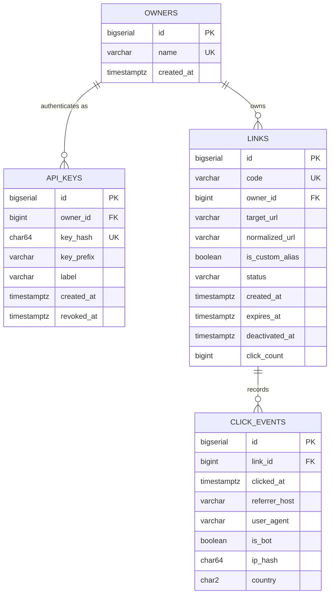

### 4.2 Table reference

| Table | Purpose | Key constraints | Indexes |
|---|---|---|---|
| `owners` | Link owners (no sign-up flow) | `name` unique | PK |
| `api_keys` | Hashed API keys per owner | `key_hash` unique, hex-64 check, FK to owners | `owner_id` |
| `links` | Short links (random codes and aliases share **one namespace**, URL-FR-2.4) | `code` unique (case-sensitive), code regex check, status check, `expires_at > created_at`, `status=INACTIVE ⇔ deactivated_at not null` | `uq_links_code`, partial index `(owner_id, normalized_url) WHERE status='ACTIVE'` for dedupe |
| `click_events` | Raw click analytics (append-only) | FK to links, country format check | `(link_id, clicked_at)` |

### 4.3 Creation script: `src/main/resources/db/migration/V1__init_schema.sql`

```sql
-- V1__init_schema.sql
-- URL Shortener schema. Owner: engineering lead. Human-approved before execution (URL-AI-1).
-- All timestamps are TIMESTAMPTZ and compared in UTC (PRD A10, R12).

CREATE TABLE owners (
    id          BIGSERIAL    PRIMARY KEY,
    name        VARCHAR(100) NOT NULL,
    created_at  TIMESTAMPTZ  NOT NULL DEFAULT now(),
    CONSTRAINT uq_owners_name UNIQUE (name)
);

CREATE TABLE api_keys (
    id          BIGSERIAL    PRIMARY KEY,
    owner_id    BIGINT       NOT NULL REFERENCES owners (id),
    key_hash    CHAR(64)     NOT NULL,              -- SHA-256 hex of the raw key; raw key never stored
    key_prefix  VARCHAR(12)  NOT NULL,              -- first chars of raw key, for human identification only
    label       VARCHAR(100) NOT NULL,
    created_at  TIMESTAMPTZ  NOT NULL DEFAULT now(),
    revoked_at  TIMESTAMPTZ,
    CONSTRAINT uq_api_keys_hash  UNIQUE (key_hash),
    CONSTRAINT chk_api_keys_hash CHECK (key_hash ~ '^[0-9a-f]{64}$')
);
CREATE INDEX idx_api_keys_owner ON api_keys (owner_id);

CREATE TABLE links (
    id               BIGSERIAL     PRIMARY KEY,
    code             VARCHAR(32)   NOT NULL,        -- 7-char base62 or 4-32 char alias, case-sensitive
    owner_id         BIGINT        NOT NULL REFERENCES owners (id),
    target_url       VARCHAR(2048) NOT NULL,
    normalized_url   VARCHAR(2048) NOT NULL,        -- used for opt-in dedupe (URL-FR-1.4)
    is_custom_alias  BOOLEAN       NOT NULL DEFAULT FALSE,
    status           VARCHAR(16)   NOT NULL DEFAULT 'ACTIVE',
    created_at       TIMESTAMPTZ   NOT NULL DEFAULT now(),
    expires_at       TIMESTAMPTZ,                   -- NULL = never expires; 'expired' is derived at read time
    deactivated_at   TIMESTAMPTZ,
    click_count      BIGINT        NOT NULL DEFAULT 0,
    CONSTRAINT uq_links_code          UNIQUE (code),
    CONSTRAINT chk_links_code         CHECK (code ~ '^[A-Za-z0-9_-]{4,32}$'),
    CONSTRAINT chk_links_status       CHECK (status IN ('ACTIVE', 'INACTIVE')),
    CONSTRAINT chk_links_expiry       CHECK (expires_at IS NULL OR expires_at > created_at),
    CONSTRAINT chk_links_deactivated  CHECK ((status = 'INACTIVE') = (deactivated_at IS NOT NULL)),
    CONSTRAINT chk_links_click_count  CHECK (click_count >= 0)
);
CREATE INDEX idx_links_owner_normalized_active
    ON links (owner_id, normalized_url)
    WHERE status = 'ACTIVE';

CREATE TABLE click_events (
    id             BIGSERIAL    PRIMARY KEY,
    link_id        BIGINT       NOT NULL REFERENCES links (id),
    clicked_at     TIMESTAMPTZ  NOT NULL,
    referrer_host  VARCHAR(255),
    user_agent     VARCHAR(512),
    is_bot         BOOLEAN      NOT NULL DEFAULT FALSE,
    ip_hash        CHAR(64),                        -- HMAC-SHA256(salt, ip); raw IP never stored
    country        CHAR(2),                         -- ISO-3166 alpha-2 or NULL
    CONSTRAINT chk_click_country CHECK (country IS NULL OR country ~ '^[A-Z]{2}$')
);
CREATE INDEX idx_click_events_link_time ON click_events (link_id, clicked_at);

COMMENT ON TABLE  click_events         IS 'Append-only click log. Loss bounded to in-memory buffer on crash (URL-FR-7.6).';
COMMENT ON COLUMN click_events.ip_hash IS 'HMAC-SHA256 with secret salt. Never store raw IP (URL-FR-7.3).';
```

### 4.4 Sample data: `src/main/resources/db/seed/V1_1__seed_demo_data.sql`

Loaded **only** with the `local` profile (`spring.flyway.locations=classpath:db/migration,classpath:db/seed`). Tests and other environments never load it.

**Demo API keys.** These are local-only demo values. The table stores only their SHA-256 hashes.

| Raw key (use in `X-API-Key`) | Owner | State | SHA-256 stored |
|---|---|---|---|
| `demo-key-alice-0001` | alice | active | `fa3eb4fb…7d37d3` |
| `demo-key-bob-0002` | bob | active | `ec11400e…c11cd7` |
| `demo-key-revoked-0003` | alice | **revoked** | `631f19aa…7f7c4d` |

```sql
-- V1_1__seed_demo_data.sql  (local profile only, never in shared environments)
-- Timestamps are relative to now() so expiry/stats demos always work.

INSERT INTO owners (id, name, created_at) VALUES
    (1, 'alice', now() - INTERVAL '30 days'),
    (2, 'bob',   now() - INTERVAL '30 days');
SELECT setval('owners_id_seq', 2);

INSERT INTO api_keys (owner_id, key_hash, key_prefix, label, created_at, revoked_at) VALUES
    (1, 'fa3eb4fb3f5e5d2e92f91162aa0b6e130435c0c8fde4a11f452db7575a7d37d3', 'demo-key-ali', 'alice local demo key', now() - INTERVAL '30 days', NULL),
    (2, 'ec11400e814678dba943e822aabc97823053cb47b2b034c3baada4cc29c11cd7', 'demo-key-bob', 'bob local demo key',   now() - INTERVAL '30 days', NULL),
    (1, '631f19aae8e1c140e79271c3cb2d9e444224423bdd81f618d1f08f5bec7f7c4d', 'demo-key-rev', 'alice revoked key',    now() - INTERVAL '30 days', now() - INTERVAL '1 day');

-- id | code        | owner | scenario
--  1 | aB3dE7x     | alice | active random code, has human + bot clicks
--  2 | spring-docs | alice | active custom alias, expires in 30 days
--  3 | Xy9Kp2Q     | alice | EXPIRED -> redirect returns 410
--  4 | Qm4Rt8Z     | bob   | INACTIVE (soft-deleted) -> redirect returns 404
--  5 | bob-blog    | bob   | active alias owned by bob -> alice gets 404 on metadata
INSERT INTO links (id, code, owner_id, target_url, normalized_url, is_custom_alias, status,
                   created_at, expires_at, deactivated_at, click_count) VALUES
    (1, 'aB3dE7x',     1, 'https://spring.io/projects/spring-boot',      'https://spring.io/projects/spring-boot',      FALSE, 'ACTIVE',   now() - INTERVAL '7 days',  NULL,                       NULL,                      6),
    (2, 'spring-docs', 1, 'https://docs.spring.io/spring-boot/index.html','https://docs.spring.io/spring-boot/index.html',TRUE, 'ACTIVE',   now() - INTERVAL '5 days',  now() + INTERVAL '30 days', NULL,                      3),
    (3, 'Xy9Kp2Q',     1, 'https://www.postgresql.org/docs/',            'https://www.postgresql.org/docs/',            FALSE, 'ACTIVE',   now() - INTERVAL '10 days', now() - INTERVAL '1 day',   NULL,                      1),
    (4, 'Qm4Rt8Z',     2, 'https://github.com/',                         'https://github.com/',                         FALSE, 'INACTIVE', now() - INTERVAL '5 days',  NULL,                       now() - INTERVAL '2 days', 0),
    (5, 'bob-blog',    2, 'https://example.com/blog/hello-world',        'https://example.com/blog/hello-world',        TRUE,  'ACTIVE',   now() - INTERVAL '4 days',  NULL,                       NULL,                      2);
SELECT setval('links_id_seq', 5);

-- ip_hash values = HMAC-SHA256("local-dev-salt", ip) for 203.0.113.10, 198.51.100.7, 192.0.2.55 (RFC 5737 test IPs)
INSERT INTO click_events (link_id, clicked_at, referrer_host, user_agent, is_bot, ip_hash, country) VALUES
    (1, now() - INTERVAL '3 days',            'twitter.com',          'Mozilla/5.0 (Macintosh; Intel Mac OS X 14_0) Safari/605.1.15', FALSE, '081be95cdda838c0390345ef0bd1004b1509648c1511d7908d01af957bf61fa5', 'US'),
    (1, now() - INTERVAL '3 days' + INTERVAL '2 hours', 'twitter.com', 'Mozilla/5.0 (Windows NT 10.0; Win64; x64) Chrome/128.0',        FALSE, '027ec7699d9fb2c0277ed9fba2da9f667d031b04f1f33117d9ff177fb6e8838b', 'GB'),
    (1, now() - INTERVAL '2 days',            'news.ycombinator.com', 'Mozilla/5.0 (Macintosh; Intel Mac OS X 14_0) Safari/605.1.15', FALSE, '081be95cdda838c0390345ef0bd1004b1509648c1511d7908d01af957bf61fa5', 'US'),
    (1, now() - INTERVAL '1 day',             NULL,                   'Googlebot/2.1 (+http://www.google.com/bot.html)',              TRUE,  '473492d386b23c12622b28329df48f1fad12822dae0f3935d37db34173d5a243', 'US'),
    (1, now() - INTERVAL '1 day',             'linkedin.com',         'Mozilla/5.0 (Windows NT 10.0; Win64; x64) Chrome/128.0',        FALSE, '027ec7699d9fb2c0277ed9fba2da9f667d031b04f1f33117d9ff177fb6e8838b', 'GB'),
    (1, now() - INTERVAL '1 hour',            NULL,                   'curl/8.4.0',                                                    TRUE,  '473492d386b23c12622b28329df48f1fad12822dae0f3935d37db34173d5a243', NULL),
    (2, now() - INTERVAL '4 days',            'google.com',           'Mozilla/5.0 (X11; Linux x86_64) Firefox/130.0',                FALSE, '081be95cdda838c0390345ef0bd1004b1509648c1511d7908d01af957bf61fa5', 'US'),
    (2, now() - INTERVAL '2 days',            'google.com',           'Mozilla/5.0 (X11; Linux x86_64) Firefox/130.0',                FALSE, '027ec7699d9fb2c0277ed9fba2da9f667d031b04f1f33117d9ff177fb6e8838b', 'DE'),
    (2, now() - INTERVAL '6 hours',           NULL,                   'Mozilla/5.0 (iPhone; CPU iPhone OS 17_0) Mobile Safari',       FALSE, '081be95cdda838c0390345ef0bd1004b1509648c1511d7908d01af957bf61fa5', 'US'),
    (3, now() - INTERVAL '5 days',            'reddit.com',           'Mozilla/5.0 (Windows NT 10.0; Win64; x64) Chrome/128.0',        FALSE, '027ec7699d9fb2c0277ed9fba2da9f667d031b04f1f33117d9ff177fb6e8838b', 'GB'),
    (5, now() - INTERVAL '2 days',            't.co',                 'Mozilla/5.0 (Macintosh; Intel Mac OS X 14_0) Safari/605.1.15', FALSE, '081be95cdda838c0390345ef0bd1004b1509648c1511d7908d01af957bf61fa5', 'US'),
    (5, now() - INTERVAL '1 day',             NULL,                   'facebookexternalhit/1.1',                                       TRUE,  '473492d386b23c12622b28329df48f1fad12822dae0f3935d37db34173d5a243', 'IE');
-- Invariant checked by SeedDataIT: links.click_count = count(click_events) per link (6, 3, 1, 0, 2).
```

### 4.5 Key queries (repository SQL)

```sql
-- LinkRepository.insertIfCodeFree  (URL-FR-1.2, 2.3) — returns 0 rows on conflict
INSERT INTO links (code, owner_id, target_url, normalized_url, is_custom_alias, expires_at)
VALUES (:code, :ownerId, :targetUrl, :normalizedUrl, :customAlias, :expiresAt)
ON CONFLICT (code) DO NOTHING
RETURNING id, code, owner_id, target_url, normalized_url, is_custom_alias, status,
          created_at, expires_at, deactivated_at, click_count;

-- LinkRepository.findDedupeCandidate  (URL-FR-1.4)
SELECT * FROM links
WHERE owner_id = :ownerId AND normalized_url = :normalizedUrl AND status = 'ACTIVE'
  AND (expires_at IS NULL OR expires_at > :now)
  AND expires_at IS NOT DISTINCT FROM :expiresAt
  AND is_custom_alias = FALSE
ORDER BY created_at DESC LIMIT 1;

-- LinkRepository.findByCode  (redirect miss / metadata)
SELECT * FROM links WHERE code = :code;

-- LinkRepository.deactivate  (URL-FR-6.1, idempotent)
UPDATE links SET status = 'INACTIVE', deactivated_at = :now
WHERE code = :code AND owner_id = :ownerId AND status = 'ACTIVE';

-- ApiKeyRepository.findActiveByHash
SELECT id, owner_id FROM api_keys WHERE key_hash = :hash AND revoked_at IS NULL;

-- StatsRepository (all filtered by link_id and [fromInclusive, toExclusive) in UTC)
SELECT count(*)                                   AS total,
       count(*) FILTER (WHERE is_bot)             AS bots,
       count(DISTINCT ip_hash)                    AS unique_visitors
FROM click_events WHERE link_id = :linkId AND clicked_at >= :from AND clicked_at < :to;

SELECT (clicked_at AT TIME ZONE 'UTC')::date      AS day,
       count(*)                                   AS clicks,
       count(*) FILTER (WHERE NOT is_bot)         AS human_clicks,
       count(DISTINCT ip_hash)                    AS unique_visitors
FROM click_events WHERE link_id = :linkId AND clicked_at >= :from AND clicked_at < :to
GROUP BY 1 ORDER BY 1;

SELECT COALESCE(referrer_host, '(direct)') AS referrer, count(*) AS clicks
FROM click_events WHERE link_id = :linkId AND clicked_at >= :from AND clicked_at < :to
GROUP BY 1 ORDER BY 2 DESC, 1 LIMIT 10;

SELECT country, count(*) AS clicks
FROM click_events WHERE link_id = :linkId AND clicked_at >= :from AND clicked_at < :to
  AND country IS NOT NULL
GROUP BY 1 ORDER BY 2 DESC, 1 LIMIT 10;

-- ClickEventRepository.flush (one transaction)
INSERT INTO click_events (link_id, clicked_at, referrer_host, user_agent, is_bot, ip_hash, country)
VALUES (?, ?, ?, ?, ?, ?, ?);                     -- JDBC batch
UPDATE links SET click_count = click_count + ? WHERE id = ?;   -- batch, one row per link in batch
```

---

## 5. API Contract

### 5.1 Common conventions
- Content type `application/json`. Field names are **snake_case** (`spring.jackson.property-naming-strategy=SNAKE_CASE`).
- Timestamps are ISO-8601 UTC (`2026-10-07T21:00:00Z`).
- Every response carries an `X-Request-Id` header.
- Error envelope (all non-2xx responses):

```json
{ "error": { "code": "ALIAS_CONFLICT", "message": "Alias 'spring-docs' is already in use.", "details": { "alias": "spring-docs" } } }
```

### 5.2 Error codes

| HTTP | `error.code` | When |
|---|---|---|
| 400 | `MALFORMED_REQUEST` | Body is not valid JSON |
| 401 | `UNAUTHORIZED` | `X-API-Key` missing, unknown or revoked |
| 404 | `NOT_FOUND` | Unknown code, inactive link (redirect), or a link not owned by the caller (API) |
| 409 | `ALIAS_CONFLICT` | Alias already exists in any status |
| 410 | `LINK_EXPIRED` | Redirect of an expired link |
| 411 | `LENGTH_REQUIRED` | POST without `Content-Length` (chunked) |
| 413 | `PAYLOAD_TOO_LARGE` | Body over 8 KB |
| 422 | `INVALID_URL` / `TARGET_BLOCKED` / `INVALID_ALIAS` / `RESERVED_ALIAS` / `INVALID_EXPIRY` / `INVALID_DATE_RANGE` / `VALIDATION_FAILED` | Validation failures (§3.3) |
| 429 | `RATE_LIMITED` | Limit exceeded. The response includes a `Retry-After` header. |
| 503 | `CODE_GENERATION_EXHAUSTED` | 5 collisions in a row |
| 503 | `NOT_READY` | `/readyz` when the DB is unreachable |
| 500 | `INTERNAL_ERROR` | Unexpected error. The message is generic and the details are only in the logs, tagged with `request_id`. |

### 5.3 Endpoints

**`POST /api/v1/links`** (URL-FR-1.x, 2.x, 4.x)
```http
POST /api/v1/links
X-API-Key: demo-key-alice-0001
Content-Type: application/json

{ "url": "https://example.org/a/very/long/path?x=1", "alias": "my-promo", "expires_at": "2026-12-31T23:59:59Z", "dedupe": false }
```
`201 Created` (`Location: /api/v1/links/my-promo`), or `200 OK` when the dedupe check finds an existing link:
```json
{ "code": "my-promo", "short_url": "http://localhost:8080/my-promo", "target": "https://example.org/a/very/long/path?x=1",
  "created_at": "2026-10-07T21:00:00Z", "expires_at": "2026-12-31T23:59:59Z", "status": "active" }
```

**`GET /api/v1/links/{code}`** (URL-FR-5.x) returns `200`:
```json
{ "code": "aB3dE7x", "short_url": "http://localhost:8080/aB3dE7x", "target": "https://spring.io/projects/spring-boot",
  "created_at": "2026-09-30T21:00:00Z", "expires_at": null, "status": "active", "total_clicks": 6 }
```

**`DELETE /api/v1/links/{code}`** (URL-FR-6.x) returns `204 No Content`, and again `204` on repeat calls.

**`GET /api/v1/links/{code}/stats?from=2026-09-08&to=2026-10-07`** (URL-FR-7.5, 7.7). Dates are inclusive and in UTC. The default range is the last 30 days and the maximum span is 365 days. `from` > `to` returns 422 `INVALID_DATE_RANGE`.
```json
{ "code": "aB3dE7x", "from": "2026-09-08", "to": "2026-10-07",
  "total_clicks": 6, "human_clicks": 4, "bot_clicks": 2, "unique_visitors_estimate": 3,
  "clicks_per_day": [ { "date": "2026-10-04", "clicks": 2, "human_clicks": 2, "unique_visitors": 2 }, "... zero-filled for every day in range ..." ],
  "top_referrers": [ { "referrer": "(direct)", "clicks": 2 }, { "referrer": "twitter.com", "clicks": 2 }, { "referrer": "linkedin.com", "clicks": 1 }, { "referrer": "news.ycombinator.com", "clicks": 1 } ],
  "top_countries": [ { "country": "US", "clicks": 3 }, { "country": "GB", "clicks": 2 } ] }
```
`top_countries` is `null` when no event in the range has a country. `total_clicks` here covers the requested range, while the metadata endpoint returns the lifetime count.

**`GET /{code}`** (URL-FR-3.x)
```http
HTTP/1.1 302 Found
Location: https://spring.io/projects/spring-boot
Cache-Control: private, no-cache, no-store, max-age=0
Pragma: no-cache
```
It returns `404 NOT_FOUND` or `410 LINK_EXPIRED` with the error envelope, without revealing the target or owner. `429 RATE_LIMITED` comes with `Retry-After`.

**`GET /healthz`** returns `200 {"status":"UP"}`. **`GET /readyz`** returns `200 {"status":"UP","checks":{"db":"UP"}}` or `503 {"status":"DOWN","checks":{"db":"DOWN"}}`.

---

## 6. Core Sequence Flows (All Flows)

### 6.1 Flow 1: API-key authentication (every `/api/v1/**` request)

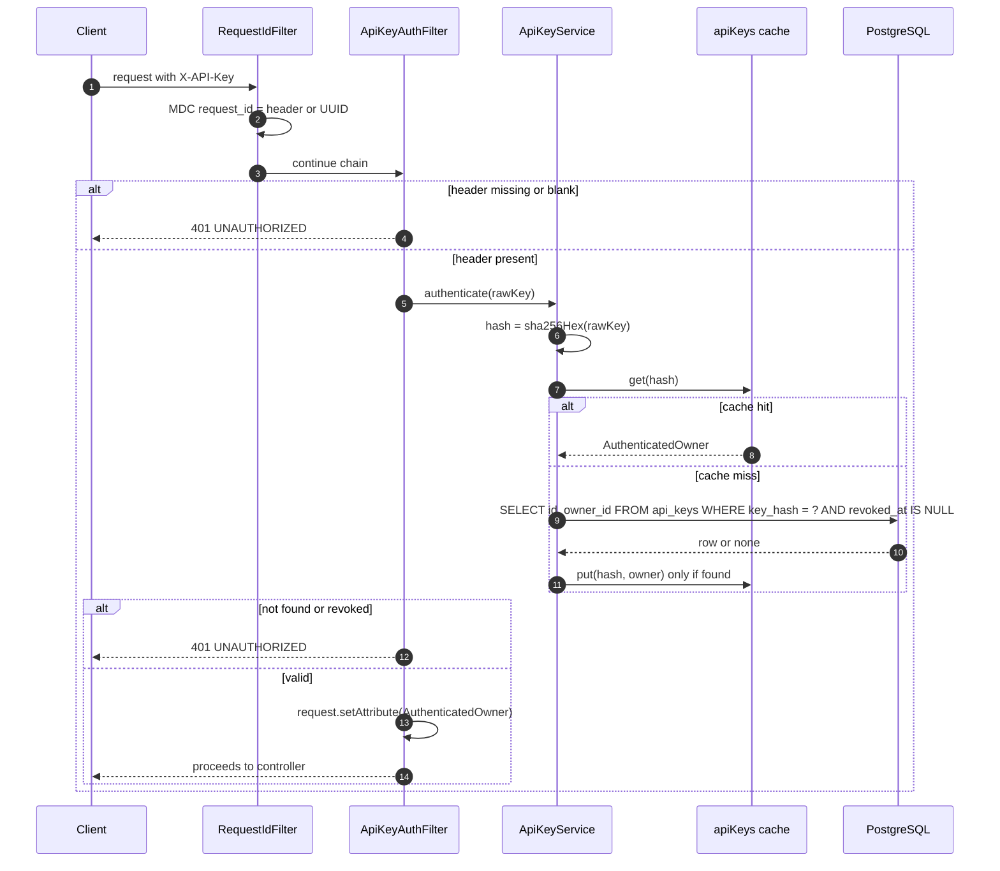

### 6.2 Flow 2: Create a short link (CUJ-1)

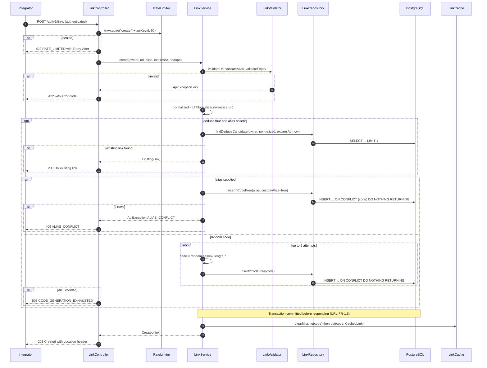

### 6.3 Flow 3: Redirect, the hot path (CUJ-2)

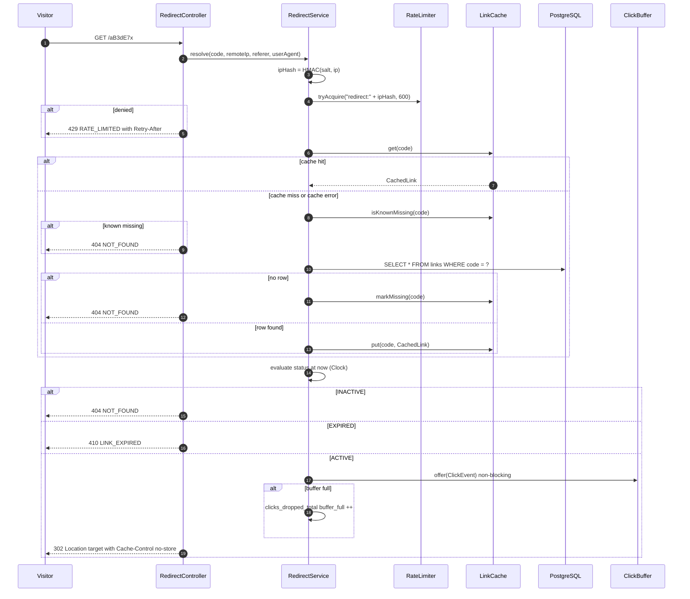

### 6.4 Flow 4: Asynchronous click flush (background)

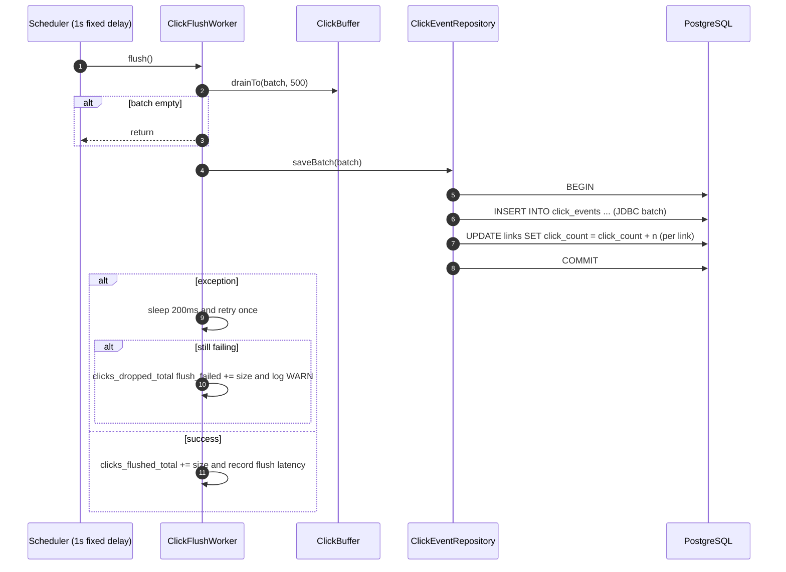

### 6.5 Flow 5: Read metadata (CUJ-3)

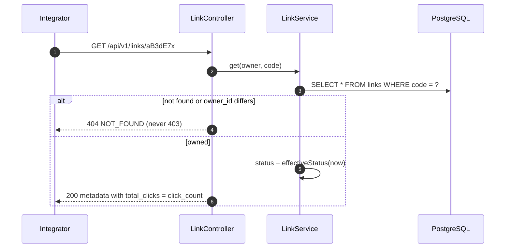

### 6.6 Flow 6: Deactivate (soft delete)

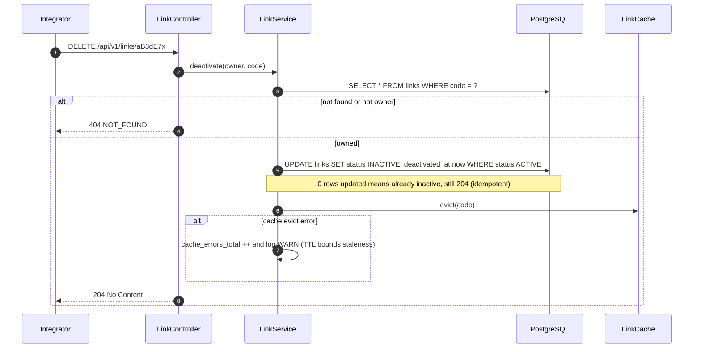

### 6.7 Flow 7: Analytics stats

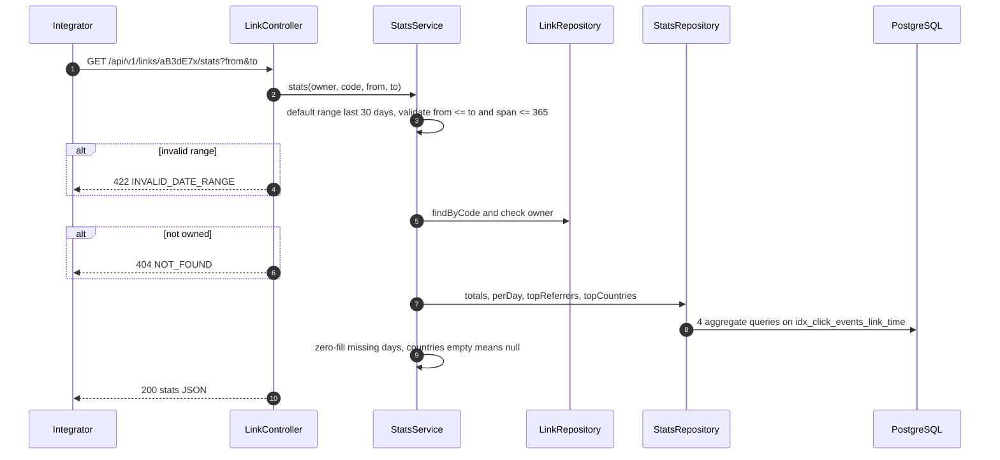

### 6.8 Flow 8: Health, readiness and degraded dependency (CUJ-4)

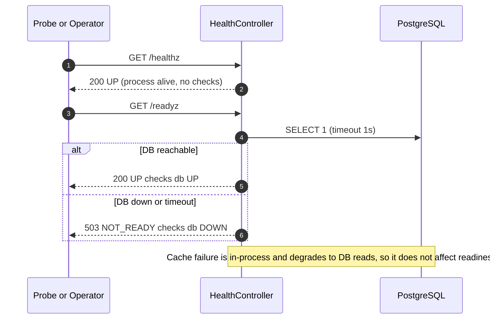

**Degraded-mode behaviour matrix**

| Failure | Redirect | Create / API | Analytics | Readiness |
|---|---|---|---|---|
| Cache throws errors | Works (DB fallback, higher latency) | Works (cache warm skipped) | Works | 200 |
| Flush failing (analytics write error) | **Works** | Works | Clicks dropped and counted | 200 |
| Click buffer full | **Works** | Works | Clicks dropped and counted | 200 |
| Postgres down | Cache hits **still redirect** until TTL. Misses return 500. | 500 | Flush retries, then drops | 503 |
| Process crash | – | Committed links are safe (NFR-3) | Buffer contents lost (≤ 1 s typical) | – |

### 6.9 Flow 9: Startup and graceful shutdown

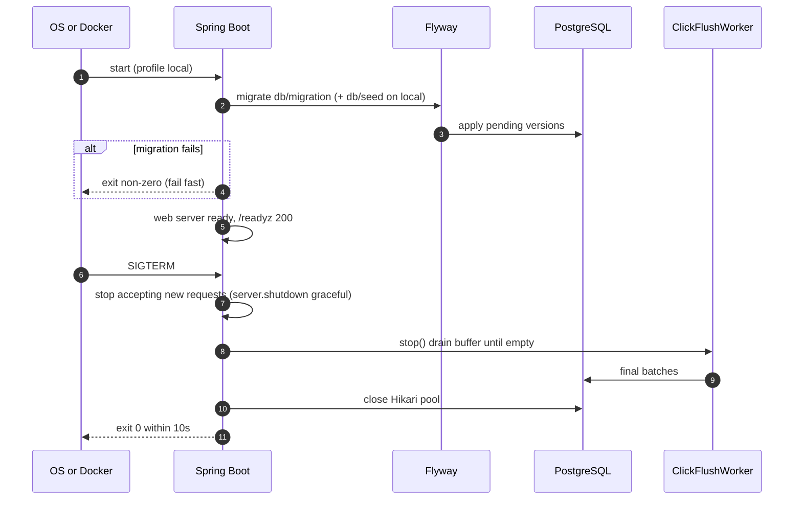

---

## 7. Working Prototype: Project Layout, Config and Build Manifest

### 7.1 Repository layout

```
url-shortener/
├── docker-compose.yml
├── Dockerfile
├── pom.xml
├── mvnw, mvnw.cmd, .mvn/
├── .gitignore  .editorconfig  .gitleaks.toml
├── .github/
│   ├── workflows/ci.yml
│   ├── pull_request_template.md
│   └── CODEOWNERS
├── config/checkstyle/checkstyle.xml
├── docs/
│   ├── prd-url-shortener.md
│   ├── design-url-shortener.md        (this file)
│   ├── adr/0001-302-redirect.md … 0010-*.md
│   ├── runbook.md
│   ├── scaling.md
│   ├── ai-usage-log.md
│   └── perf/ (k6 results)
├── perf/k6/redirect-hit.js  redirect-miss.js
├── scripts/
│   ├── demo.sh                       (end-to-end curl demo)
│   └── create-api-key.sh             (key provisioning, URL-NFR-4.2)
└── src/
    ├── main/java/com/example/urlshortener/
    │   ├── UrlShortenerApplication.java
    │   ├── config/      AppProperties, ClockConfig, CacheConfig, OpenApiConfig, SchedulingConfig
    │   ├── api/
    │   │   ├── LinkController, RedirectController, HealthController
    │   │   ├── dto/     CreateLinkRequest, LinkResponse, LinkMetadataResponse, StatsResponse, ErrorResponse
    │   │   ├── error/   ErrorCode, ApiException, GlobalExceptionHandler
    │   │   └── filter/  RequestIdFilter, BodySizeLimitFilter, SecurityHeadersFilter, ApiKeyAuthFilter
    │   ├── service/
    │   │   ├── LinkService, RedirectService, StatsService, ApiKeyService
    │   │   ├── LinkValidator, UrlNormalizer, BotDetector, IpHasher
    │   │   ├── port/    LinkCache, ClickSink, RateLimiter      (interfaces)
    │   │   └── domain/  Link, LinkStatus, EffectiveStatus, CachedLink, ClickEvent,
    │   │                AuthenticatedOwner, RedirectResult, LinkStats, CreateResult
    │   ├── repository/  LinkRepository, ApiKeyRepository, ClickEventRepository, StatsRepository
    │   └── infra/       CaffeineLinkCache, ClickBuffer, ClickFlushWorker, CaffeineRateLimiter
    ├── main/resources/
    │   ├── application.yml  application-local.yml  logback-spring.xml
    │   ├── db/migration/V1__init_schema.sql
    │   └── db/seed/V1_1__seed_demo_data.sql
    └── test/java/com/example/urlshortener/
        ├── unit/        (service tests, fixed Clock)
        ├── web/         (@WebMvcTest slices)
        ├── it/          (Testcontainers @SpringBootTest)
        ├── arch/        LayeringArchTest
        └── contract/    OpenApiContractTest   (+ src/test/resources/openapi-baseline.json)
```

### 7.2 `docker-compose.yml`

```yaml
services:
  postgres:
    image: postgres:16.4-alpine
    container_name: urlshortener-db
    environment:
      POSTGRES_DB: urlshortener
      POSTGRES_USER: postgres
      POSTGRES_HOST_AUTH_METHOD: trust      # LOCAL ONLY: credentials intentionally ignored (see §16.2)
    ports: ["5432:5432"]
    volumes: ["pgdata:/var/lib/postgresql/data"]
    healthcheck:
      test: ["CMD-SHELL", "pg_isready -U postgres -d urlshortener"]
      interval: 5s
      timeout: 3s
      retries: 10

  app:                                       # optional: run app in Docker too
    build: .
    profiles: ["full"]
    depends_on: { postgres: { condition: service_healthy } }
    environment:
      SPRING_PROFILES_ACTIVE: local
      SPRING_DATASOURCE_URL: jdbc:postgresql://postgres:5432/urlshortener
      APP_BASE_URL: http://localhost:8080
    ports: ["8080:8080"]

volumes:
  pgdata:
```

### 7.3 `application.yml` (defaults) and `application-local.yml`

```yaml
# application.yml
server:
  port: 8080
  shutdown: graceful
  error: { include-stacktrace: never, include-message: never }
spring:
  application.name: url-shortener
  threads.virtual.enabled: true
  lifecycle.timeout-per-shutdown-phase: 10s
  datasource:
    url: ${SPRING_DATASOURCE_URL:jdbc:postgresql://localhost:5432/urlshortener}
    username: ${SPRING_DATASOURCE_USERNAME:postgres}
    password: ${SPRING_DATASOURCE_PASSWORD:}          # empty locally; injected from secret store elsewhere
    hikari: { maximum-pool-size: 20, connection-timeout: 2000 }
  flyway: { enabled: true, locations: classpath:db/migration }
  jackson:
    property-naming-strategy: SNAKE_CASE
    deserialization: { fail-on-unknown-properties: true }
    serialization: { write-dates-as-timestamps: false }
    default-property-inclusion: always
springdoc:
  api-docs.path: /openapi.json
  swagger-ui.path: /docs
management:
  endpoints.web.exposure.include: health,prometheus
  metrics.distribution.percentiles-histogram.http.server.requests: true
app:
  base-url: ${APP_BASE_URL:http://localhost:8080}
  links:
    code-length: 7
    max-codegen-attempts: 5
    allowed-schemes: [http, https]
    max-url-length: 2048
    max-expiry: P365D
    blocked-domains: []
    reserved-words: [api, healthz, readyz, docs, redoc, openapi, openapi.json, static, admin,
                     metrics, favicon.ico, robots.txt, actuator, swagger-ui, v3, error]
  cache: { ttl: PT10M, negative-ttl: PT60S, max-size: 100000, api-key-ttl: PT30S }
  rate-limit: { create-per-minute: 60, redirect-per-minute: 600 }
  analytics:
    buffer-capacity: 10000
    flush-interval: PT1S
    flush-batch-size: 500
    ip-salt: ${APP_IP_SALT:change-me}                 # secret in shared envs (URL-NFR-4.4)
    bot-patterns-version: "2026-10-01"
    bot-patterns: ["(?i)bot", "(?i)crawler", "(?i)spider", "(?i)curl/", "(?i)wget/",
                   "(?i)facebookexternalhit", "(?i)slurp", "(?i)python-requests", "(?i)headless"]
```

```yaml
# application-local.yml
spring.flyway.locations: classpath:db/migration,classpath:db/seed
app.analytics.ip-salt: local-dev-salt
logging.level.com.example.urlshortener: DEBUG
```

### 7.4 `pom.xml` dependencies (pin exact patch versions at generation time)

| Scope | Artifact | Purpose |
|---|---|---|
| parent | `org.springframework.boot:spring-boot-starter-parent:3.3.x` | BOM |
| compile | `spring-boot-starter-web`, `spring-boot-starter-jdbc`, `spring-boot-starter-validation`, `spring-boot-starter-actuator` | Core |
| compile | `org.flywaydb:flyway-core`, `org.flywaydb:flyway-database-postgresql` | Migrations |
| runtime | `org.postgresql:postgresql` | Driver |
| compile | `com.github.ben-manes.caffeine:caffeine` | Cache, rate limit |
| compile | `org.springdoc:springdoc-openapi-starter-webmvc-ui:2.6.x` | Swagger at `/docs` |
| runtime | `io.micrometer:micrometer-registry-prometheus` | Metrics |
| runtime | `net.logstash.logback:logstash-logback-encoder:7.4` | JSON logs |
| test | `spring-boot-starter-test`, `org.testcontainers:postgresql`, `org.testcontainers:junit-jupiter`, `spring-boot-testcontainers` | Tests |
| test | `com.tngtech.archunit:archunit-junit5:1.3.x` | Layering rules |
| plugin | `jacoco-maven-plugin` (gate: `service` package LINE ≥ 0.85) | Coverage |
| plugin | `spotless-maven-plugin` (google-java-format) | Formatting |
| plugin | `maven-checkstyle-plugin`, `spotbugs-maven-plugin` (+ find-sec-bugs) | Static analysis |
| plugin | `org.owasp:dependency-check-maven` (fail on CVSS ≥ 7) | Dependency security |
| plugin | `maven-compiler-plugin` with `-Xlint:all -Werror -parameters` | Strict type checking (URL-NFR-5.2) |

### 7.5 Build manifest (generation order)

Generate and commit in this order. Each step should compile, and its tests should pass, before moving to the next. Each step corresponds to one PR (URL-AI-4).

| Step | Files | Done when |
|---|---|---|
| 1 | `pom.xml`, `docker-compose.yml`, `UrlShortenerApplication`, `application*.yml`, `logback-spring.xml` | `./mvnw verify` green on an empty app |
| 2 | `V1__init_schema.sql`, `V1_1__seed_demo_data.sql`, `SeedDataIT` | Flyway applies and the seed invariant holds |
| 3 | `service/domain/*`, `service/port/*`, `config/AppProperties`, `config/ClockConfig` | Compiles |
| 4 | `LinkValidator`, `UrlNormalizer`, `BotDetector`, `IpHasher` + unit tests | ≥ 95% coverage on these |
| 5 | Repositories + ITs | CRUD ITs green |
| 6 | `api/error/*`, filters, `ApiKeyService` + tests | 401 paths green |
| 7 | `LinkService`, `LinkController` (create, get, delete) + tests | CUJ-1 and CUJ-3 (minus stats) green |
| 8 | `CaffeineLinkCache`, `CaffeineRateLimiter`, `RedirectService`, `RedirectController` + tests | CUJ-2 green, 302/404/410/429 |
| 9 | `ClickBuffer`, `ClickFlushWorker` + tests | Click visible in DB within 2 s |
| 10 | `StatsService`, `StatsRepository`, stats endpoint + tests | Stats match seed data |
| 11 | `HealthController`, `OpenApiConfig`, contract baseline, `LayeringArchTest` | All gates green |
| 12 | `Dockerfile`, `scripts/*`, `perf/k6/*`, `docs/runbook.md`, `docs/scaling.md`, ADRs | Demo script passes and k6 meets NFR-1 |

### 7.6 Run it end to end

```bash
# 1. Start Postgres
docker compose up -d postgres

# 2. Run the app (applies schema + demo data)
./mvnw spring-boot:run -Dspring-boot.run.profiles=local
#   or: docker compose --profile full up --build

# 3. Explore
open http://localhost:8080/docs
```

### 7.7 `scripts/demo.sh`: end-to-end walkthrough (CUJ-1 to CUJ-4)

```bash
#!/usr/bin/env bash
set -euo pipefail
BASE=${BASE:-http://localhost:8080}
ALICE="X-API-Key: demo-key-alice-0001"
BOB="X-API-Key: demo-key-bob-0002"

echo "== Health";              curl -s $BASE/healthz; echo; curl -s $BASE/readyz; echo
echo "== Create random code";  curl -s -X POST $BASE/api/v1/links -H "$ALICE" -H 'Content-Type: application/json' \
                                 -d '{"url":"https://openjdk.org/projects/jdk/21/"}' | tee /tmp/created.json; echo
CODE=$(sed -E 's/.*"code":"([^"]+)".*/\1/' /tmp/created.json)
echo "== Redirect ($CODE)";    curl -s -o /dev/null -w '%{http_code} -> %{redirect_url}\n' $BASE/$CODE
echo "== Custom alias";        curl -s -X POST $BASE/api/v1/links -H "$ALICE" -H 'Content-Type: application/json' \
                                 -d '{"url":"https://example.org/promo","alias":"fall-promo","expires_at":"2026-12-31T00:00:00Z"}'; echo
echo "== Alias conflict 409";  curl -s -X POST $BASE/api/v1/links -H "$BOB" -H 'Content-Type: application/json' \
                                 -d '{"url":"https://example.org/x","alias":"fall-promo"}'; echo
echo "== Reserved alias 422";  curl -s -X POST $BASE/api/v1/links -H "$ALICE" -H 'Content-Type: application/json' \
                                 -d '{"url":"https://example.org/x","alias":"Docs"}'; echo
echo "== Bad scheme 422";      curl -s -X POST $BASE/api/v1/links -H "$ALICE" -H 'Content-Type: application/json' \
                                 -d '{"url":"javascript:alert(1)"}'; echo
echo "== Revoked key 401";     curl -s -o /dev/null -w '%{http_code}\n' -X POST $BASE/api/v1/links \
                                 -H 'X-API-Key: demo-key-revoked-0003' -H 'Content-Type: application/json' -d '{"url":"https://a.io"}'
echo "== Expired 410";         curl -s -o /dev/null -w '%{http_code}\n' $BASE/Xy9Kp2Q
echo "== Inactive 404";        curl -s -o /dev/null -w '%{http_code}\n' $BASE/Qm4Rt8Z
echo "== Not owner 404";       curl -s -o /dev/null -w '%{http_code}\n' -H "$ALICE" $BASE/api/v1/links/bob-blog
sleep 2
echo "== Metadata";            curl -s -H "$ALICE" $BASE/api/v1/links/$CODE; echo
echo "== Stats (seeded)";      curl -s -H "$ALICE" $BASE/api/v1/links/aB3dE7x/stats; echo
echo "== Deactivate";          curl -s -o /dev/null -w '%{http_code}\n' -X DELETE -H "$ALICE" $BASE/api/v1/links/$CODE
echo "== Redirect after 404";  curl -s -o /dev/null -w '%{http_code}\n' $BASE/$CODE
```

### 7.8 `scripts/create-api-key.sh` (URL-NFR-4.2)
Generates a 32-byte random key (`openssl rand -base64 32 | tr '+/' '-_' | tr -d '='`), computes its SHA-256, and runs an `INSERT INTO api_keys …` through `docker exec urlshortener-db psql`. It prints the raw key **once** to stdout. The raw key is never written to disk or logs.

---

## 8. Testing Strategy

### 8.1 Test pyramid

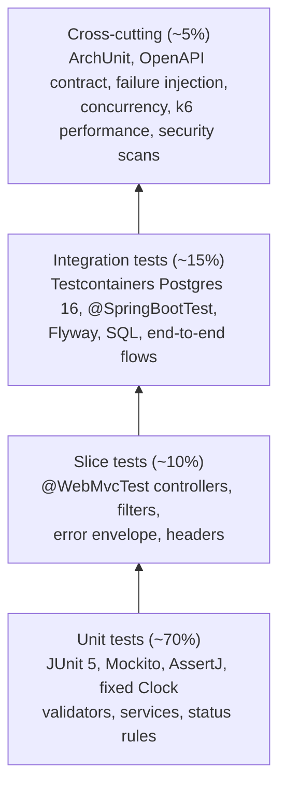

### 8.2 Test types, tools and gates

| Type | Tool | Scope | Runs | Gate |
|---|---|---|---|---|
| Unit | JUnit 5, Mockito, AssertJ | `service`, `infra` logic | Every commit | Must pass. Service coverage ≥ 85%. |
| Web slice | `@WebMvcTest`, MockMvc | Status codes, envelope, headers, filters | Every PR | Must pass |
| Integration | Testcontainers `postgres:16.4-alpine` | Repositories, migrations, full flows | Every PR | Must pass |
| Architecture | ArchUnit | Layer dependencies (§8.4) | Every PR | Must pass |
| Contract | Generated `/openapi.json` vs `openapi-baseline.json` | API drift | Every PR | A diff fails unless the baseline is updated in the same PR and approved by a human |
| Failure injection | Mocks or a toggled `LinkCache`/`ClickEventRepository` that throws | NFR-2 degradation | Every PR | Must pass |
| Concurrency | `ExecutorService` with 20 parallel creates of the same alias | Exactly one 201 and the rest 409 | Every PR | Must pass |
| Performance | k6 (Docker `grafana/k6`) | NFR-1 p95 | Nightly and before release | p95 hit < 20 ms, miss < 50 ms |
| Security | gitleaks, OWASP Dependency-Check, SpotBugs + find-sec-bugs | Secrets, CVEs, insecure code | Every PR | 0 secrets, 0 CVSS ≥ 7, 0 high bugs |
| Mutation (P2) | PIT on `service` | Test strength | Weekly | Report only, target ≥ 70% |

### 8.3 Acceptance test catalogue (traceability: test name starts with the PRD ID)

| PRD ID | Test (class.method) | Type | Asserts |
|---|---|---|---|
| URL-FR-1.1 | `LinkApiIT.fr1_1_createReturns201With7CharCode` | IT | 201, `code` matches `^[A-Za-z0-9]{7}$`, `Location` header |
| URL-FR-1.2 | `LinkServiceTest.fr1_2_retriesOnCollisionThenSucceeds` / `…_exhaustsAfter5` | Unit | Retry count, 503 code |
| URL-FR-1.3 | `LinkApiIT.fr1_3_sameUrlTwiceGivesTwoCodes` | IT | Codes differ |
| URL-FR-1.4 | `LinkApiIT.fr1_4_dedupeReturnsExisting200` / `…_neverAcrossOwners` | IT | 200 with same code; other owner gets new code |
| URL-FR-1.5 | `LinkValidatorTest.fr1_5_*` (parameterised: `ftp:`, `javascript:`, no host, userinfo, self host, 2049 chars) | Unit | `INVALID_URL` |
| URL-FR-1.6 | `LinkApiIT.fr1_6_linkReadableImmediatelyAfter201` | IT | DB row exists before response |
| URL-FR-2.1–2.3 | `LinkValidatorTest.fr2_*`, `LinkApiIT.fr2_3_aliasConflict409EvenWhenInactive` | Unit/IT | 422 / 409 |
| URL-FR-3.1–3.3 | `RedirectApiIT.fr3_1_redirect302`, `fr3_2_unknown404_inactive404_expired410`, `fr3_3_noStoreHeaders` | IT | Status, `Location`, `Cache-Control` |
| URL-FR-3.4/3.6 | `RedirectServiceTest.fr3_4_cacheHitSkipsDb`, `fr3_6_negativeCacheSkipsDb` | Unit | Repository not invoked |
| URL-FR-3.5 | `RedirectDegradationIT.fr3_5_cacheErrorFallsBackToDb`, `fr3_5_fullBufferStillRedirects` | IT | 302 still returned, metric incremented |
| URL-FR-3.7 | `RedirectApiIT.fr3_7_rateLimited429WithRetryAfter` | IT | First request over the limit returns 429 with `Retry-After` (limit lowered to 5/min in test config) |
| URL-FR-4.2/4.3 | `LinkValidatorTest.fr4_2_*` (past, now, +366d), `LinkTest.fr4_3_expiryBoundaryIsExclusive` | Unit | 422; at `expiresAt` exactly, the link is expired |
| URL-FR-5.1/5.2 | `LinkApiIT.fr5_1_metadata`, `fr5_2_nonOwner404_missingKey401` | IT | Body fields, 404/401 |
| URL-FR-6.1–6.3 | `LinkApiIT.fr6_1_softDeleteKeepsRow`, `fr6_2_idempotent204`, `fr6_3_redirect404ImmediatelyAfterDelete` | IT | DB state, cache evicted |
| URL-FR-7.1–7.4 | `ClickPipelineIT.fr7_1_oneEventPer302_noneFor404`, `IpHasherTest.fr7_3_noRawIp`, `BotDetectorTest.fr7_4_*` | IT/Unit | Counts, hash format, bot flag |
| URL-FR-7.5/7.7 | `StatsApiIT.fr7_5_statsMatchSeed`, `StatsServiceTest.fr7_5_zeroFillsDays`, `fr7_5_rangeOver365_422` | IT/Unit | Exact numbers from the seed (6 total, 2 bots, 3 unique) |
| URL-FR-7.6 | `ClickFlushWorkerTest.fr7_6_shutdownDrainsBuffer`, `fr7_6_flushFailureDropsAndCounts` | Unit | Drained, metric |
| URL-FR-8.1/8.2 | `HealthIT.fr8_1_healthz200`, `fr8_2_readyz503WhenDbDown` (stop container) | IT | 200 / 503 |
| URL-NFR-4.1 | `ApiKeyAuthFilterTest.nfr4_1_*` | Slice | 401 cases, the raw key is never logged (log appender captured) |
| URL-NFR-4.5 | `BodySizeLimitFilterTest.nfr4_5_over8kb413`, `LinkApiIT.nfr4_5_unknownField422` | Slice/IT | 413 / 422 |
| URL-NFR-5.1 | `LayeringArchTest` | Arch | §8.4 rules |

The CI step `scripts/check-traceability.sh` greps every P0 ID from the PRD and fails the build if an ID has no matching test name (URL-TEST-3).

### 8.4 Architecture rules (ArchUnit)
1. `..service..` must not depend on `..api..`, `..infra..`, `jakarta.servlet..`, `org.springframework.web..` or `org.springframework.jdbc..`.
2. `..repository..` must not depend on `..api..` or `..service..` (except `service.domain`).
3. `..api..` must not depend on `..repository..` (controllers call services only).
4. `..infra..` may depend on `service.port` and `service.domain` and `repository` only.
5. No class may call `Instant.now()`, `LocalDate.now()` or `System.currentTimeMillis()` outside `config.ClockConfig`.

### 8.5 Test data strategy
- Integration tests use a **clean schema per test class** (Flyway `clean` + `migrate`, with `cleanDisabled=false` set only in tests). Each test creates its own data through builders. The demo seed is never used except in `SeedDataIT` and `StatsApiIT.fr7_5_statsMatchSeed`.
- Time-dependent tests inject `Clock.fixed(...)` through a `@TestConfiguration`.
- k6 setup creates 1,000 links through the API, then hits random codes (hit) or random non-existent codes with the negative cache disabled (miss).

### 8.6 Performance test definition (URL-TEST-2, resolves PRD OQ-9)
- **Tool:** k6. **Environment:** a developer laptop, with app and Postgres in Docker on the same host. Hardware is recorded in `docs/perf/README.md`.
- **Profile:** 2-minute ramp to 200 virtual users, then a 5-minute steady phase, with `redirects: 0` (k6 `redirects` set to 0 so 302s are not followed).
- **Thresholds:** `http_req_duration{scenario:hit} p(95)<20`, `{scenario:miss} p(95)<50`, `http_req_failed<0.1%`.
- Results are written as JSON to `docs/perf/<date>-<sha>.json`.

---

## 9. Quality Gates and Measurement of Quality

### 9.1 Gate pipeline

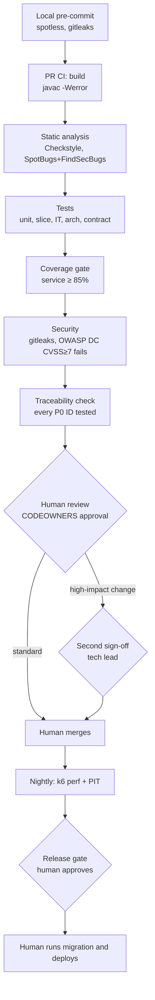

### 9.2 Gate definitions

| Gate | Category | Tool or check | Pass criterion | Blocking |
|---|---|---|---|---|
| G1 | Formatting / lint | Spotless (google-java-format), Checkstyle | 0 violations | Yes |
| G2 | Compile / type safety | `javac -Xlint:all -Werror` | 0 warnings | Yes |
| G3 | Static analysis | SpotBugs + FindSecBugs | 0 High/Medium bugs | Yes |
| G4 | Tests | Maven Surefire + Failsafe | 100% pass, 0 skipped without a linked ticket | Yes |
| G5 | Coverage | JaCoCo | `service` LINE ≥ 85%, overall ≥ 75%, no PR may lower service coverage by more than 1% | Yes |
| G6 | Architecture | ArchUnit | All rules pass | Yes |
| G7 | API contract | Baseline diff | No unapproved drift | Yes |
| G8 | Secrets | gitleaks | 0 findings | Yes |
| G9 | Dependencies | OWASP Dependency-Check | 0 CVEs with CVSS ≥ 7 (suppressions need an ADR) | Yes |
| G10 | Traceability | `check-traceability.sh` | Every P0 PRD ID has a test | Yes |
| G11 | Performance | k6 thresholds (§8.6) | p95 targets met | Release gate |
| G12 | Human review | Branch protection + CODEOWNERS | ≥ 1 approval, plus a second for high-impact changes (§10.5) | Yes |

### 9.3 Measurement of quality (dashboard KPIs)

| Dimension | Metric | Source | Target |
|---|---|---|---|
| Correctness | P0 acceptance tests passing | CI | 100% |
| Correctness | Escaped defects per release | Issue tracker label `escaped` | ≤ 1 |
| Maintainability | Service-layer line / branch coverage | JaCoCo | ≥ 85% / ≥ 75% |
| Maintainability | Mutation score (service) | PIT | ≥ 70% (P2) |
| Maintainability | Checkstyle/SpotBugs violations | CI | 0 |
| Maintainability | Average PR size (changed lines) | GitHub | ≤ 400 |
| Security | Secrets found / high CVEs | gitleaks / OWASP DC | 0 / 0 |
| Performance | Redirect p95 hit / miss | k6 | < 20 ms / < 50 ms |
| Reliability | Redirect success under cache and analytics failure | Failure-injection IT | 100% |
| Reliability | `clicks_dropped_total` / `clicks_flushed_total` | Prometheus | < 0.1% |
| Operability | Cache hit ratio | Prometheus | > 90% under k6 hit scenario |
| Process | PRs with requirement ID and acceptance list | PR template check | 100% |
| Process | AI-assisted PRs reverted or reworked > 1 round | `ai-usage-log.md` | Tracked; trend down |
| Process | AI merges, migrations or deploys without a human | Audit of GitHub events | 0 |

### 9.4 Runtime metrics (Micrometer names)

`http.server.requests` (latency histogram per route and status) · `urlshortener.cache.requests{cache,result=hit|miss}` · `urlshortener.cache.errors` · `urlshortener.negative_cache.hits` · `urlshortener.codegen.retries` · `urlshortener.codegen.exhausted` · `urlshortener.clicks.buffer.depth` (gauge) · `urlshortener.clicks.flushed` · `urlshortener.clicks.dropped{reason}` · `urlshortener.clicks.flush.duration` · `urlshortener.ratelimit.denied{bucket}` · `hikaricp.connections.*`

### 9.5 Structured log fields
`timestamp, level, logger, message, request_id, route, method, status, latency_ms, owner_id (if authenticated), code (if any)`. **Never logged:** raw IP, raw API key, full request body, `Authorization`/`X-API-Key` headers. This is enforced by a unit test that captures log output.

---

## 10. AI-Assisted Engineering Model

### 10.1 Operating principle
> **The engineer leads execution and approves all outputs. AI assists within tasks.**
> The engineer owns correctness, maintainability and production readiness. AI output is a *proposal* until a human has read it, run it and approved it.

### 10.2 Responsibility matrix (RACI)

| Activity | Engineer | AI assistant | Reviewer / Tech lead |
|---|---|---|---|
| Interpret requirements and resolve ambiguity | **A/R**, decides | C: drafts interpretations and options | C |
| Design and ADRs | **A/R** | C: drafts, compares alternatives | Approves |
| Implementation | **A**, reviews every line | R: drafts code within one ticket | C |
| Debugging | **A/R**, reproduces and confirms the root cause | C: hypotheses, log analysis, minimal repro | – |
| Refactoring | **A** | R: mechanical changes behind passing tests | Approves |
| Test generation | **A**, checks that the tests prove the acceptance criteria | R: drafts cases, including edge cases | C |
| Documentation | **A** | R: drafts README, runbook, OpenAPI descriptions | C |
| Review preparation | **A** | R: PR description, change summary, risk notes, checklist | – |
| Merge | **A/R** | **Not permitted** | Approves |
| Run DB migrations | **A/R** | **Not permitted** (may draft the SQL) | Approves |
| Deploy / release | **A/R** | **Not permitted** | Approves |

R = Responsible, A = Accountable, C = Consulted.

### 10.3 How AI is used in each activity

| Activity | Good use | Required human check | Artifact |
|---|---|---|---|
| **Implementation** | Give the AI this design section, the ticket ID and its acceptance criteria. Ask for one class plus its tests. | Read the diff, run the tests locally, check the SQL against §4.5 | PR + `ai-usage-log.md` entry |
| **Debugging** | Paste a *sanitised* stack trace or log (with `request_id`, no secrets) and ask for ranked hypotheses and a minimal failing test | The engineer reproduces the failure and confirms the root cause before any fix | Failing test committed first |
| **Refactoring** | Ask for a behaviour-preserving change with "do not change public signatures or tests" | Contract and ArchUnit tests unchanged and green, coverage not lowered | PR labelled `refactor` |
| **Test generation** | Ask for boundary and negative cases from the §3.3 tables, and for property-style cases for validators | Mutate the code by hand (or with PIT) to confirm the tests fail; reject tests that only assert mocks | Tests named with PRD IDs |
| **Documentation** | Generate a runbook draft from §6.8 and OpenAPI examples from §5 | Engineer runs every command in the doc | `docs/*.md` |
| **Review preparation** | AI writes the PR body: summary, IDs, acceptance criteria met, risks, rollback, test evidence | The engineer edits it and confirms the claims are true | PR description |

### 10.4 Secure AI usage policy (enforces URL-AI-6)

1. **No secrets in prompts.** No real API keys, salts, DB passwords, tokens or production data. Only the seeded demo keys (§4.4) may appear.
2. **No production data.** Use RFC 5737 test IPs and synthetic URLs only.
3. **Approved tools only.** Use the organisation's AI tooling, with data retention settings reviewed. No pasting code into unapproved services.
4. **No autonomous actions.** AI agents have no merge rights, no DB credentials beyond local and no deploy permissions. CI tokens used by AI tooling are read-only. Branch protection blocks direct pushes to `main`.
5. **Check suggested dependencies.** Every new dependency the AI suggests must exist on Maven Central, have a known maintainer and pass OWASP DC. A human adds it to the POM (this guards against package hallucination and typosquatting).
6. **Licence hygiene.** Generated code that looks copied from a third-party source is rewritten or attributed.
7. **Provenance.** Every AI-assisted PR carries the label `ai-assisted` and an `ai-usage-log.md` entry: ticket, task, what the AI drafted, what the human changed and the verification done.
8. **Prompt hygiene in logs.** AI session transcripts stored in the repo must pass gitleaks.

### 10.5 Human sign-off for high-impact changes

| Change type | Examples | Required approvals | Extra evidence |
|---|---|---|---|
| **DB schema / migration** | Any `db/migration/V*.sql` | Engineer + tech lead (CODEOWNERS on `db/`) | Migration tested on a copy of the seed, a rollback/forward-fix note, and a lock-impact note |
| **Security-sensitive** | Filters, auth, `IpHasher`, validators, CORS, headers | Engineer + security-aware reviewer | Negative tests, threat note |
| **API contract** | `openapi-baseline.json` change | Engineer + tech lead | Backward-compatibility statement |
| **Dependencies** | `pom.xml` additions or upgrades | Engineer + tech lead | OWASP DC report, reason |
| **Config defaults** | Rate limits, TTLs, buffer sizes | Engineer + tech lead | Load-test evidence |
| **Release / deploy** | Tag, deploy, migration run | Tech lead, performed by a human | All gates green, k6 report |
| Standard change | Service logic, tests, docs | 1 reviewer | CI green |

`CODEOWNERS`:
```
/src/main/resources/db/   @tech-lead
/src/main/java/**/filter/ @tech-lead @security-reviewer
/src/main/java/**/service/IpHasher.java  @security-reviewer
/pom.xml                  @tech-lead
/src/test/resources/openapi-baseline.json @tech-lead
```

### 10.6 PR template (`.github/pull_request_template.md`)

```markdown
## Ticket / requirement IDs
URL-FR-x.y …

## What changed and why

## Acceptance criteria satisfied
- [ ] URL-FR-x.y — test: `ClassName.method`

## AI assistance
- [ ] No AI used   - [ ] AI-assisted (label `ai-assisted`, logged in docs/ai-usage-log.md)
What AI drafted: …   What I changed/verified: …

## Risk & rollback
High-impact category (§10.5): none / migration / security / contract / deps / config
Rollback plan: …

## Evidence
- [ ] Tests added/updated and fail without this change (bug fixes)
- [ ] `./mvnw verify` green locally
- [ ] Docs/ADR updated

## Engineer ownership
- [ ] I have read every line of this diff and I own its correctness, maintainability and production readiness.
```

### 10.7 Well-defined vs ambiguous requirements: triage rubric

Every ticket is classified **before** implementation:

| Signal | Well-defined | Ambiguous |
|---|---|---|
| Acceptance criterion | Testable (status code, value, threshold) | Adjective ("faster", "more accurate", "better") |
| Inputs/outputs | Specified | Implied |
| Conflicts | None | Contradicts another requirement (for example FR-8 vs NFR-2 on readiness) |
| Owner of decision | Clear | Unknown |

**Ambiguous workflow:** (1) the AI drafts an interpretation note with 2–4 options and their trade-offs; (2) the engineer adds constraints and picks one, escalating to the product owner if it changes behaviour that users see; (3) the decision is recorded as an ADR; (4) the ticket is rewritten with testable criteria; (5) it is then implemented as a well-defined ticket. §11.4 has a worked example.

---

## 11. Scenarios: Greenfield, Brownfield, Ambiguous

### 11.1 Scenario overview

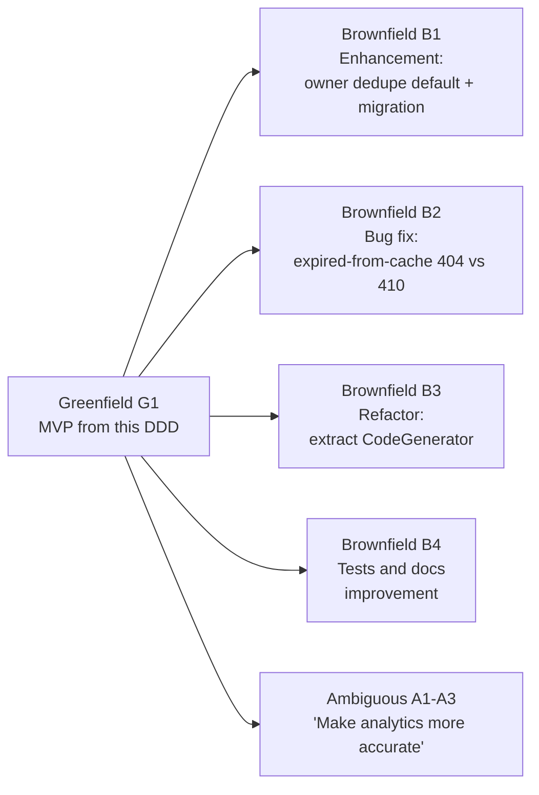

Each scenario produces this evidence trail: **ticket → AI interaction log → design note / ADR → PR → CI report → human review decision**.

### 11.2 Greenfield: G1 (new system)

| Step | Engineer | AI |
|---|---|---|
| 1 | Breaks §7.5 into 12 tickets | Drafts ticket text from the DDD sections |
| 2 | For each ticket, gives the AI the relevant DDD section and IDs | Drafts code and tests |
| 3 | Runs `./mvnw verify`, reads the diff, fixes issues | Explains failures, suggests fixes |
| 4 | Opens the PR | Drafts the PR body from the template |
| 5 | Reviewer approves, engineer merges | – |
| **Done when** | All P0 tests are green, `demo.sh` passes, and k6 meets NFR-1 | |

### 11.3 Brownfield (existing codebase)

#### B1: Enhancement (owner default dedupe, with a migration)
- **Change:** add an owner-level default for dedupe. A request's `dedupe` field, when present, overrides it (PRD A4).
- **Migration `V2__owner_dedupe_default.sql`** (backward-compatible: adding a column with a constant default in PG 11+ is a metadata-only change, no table rewrite):
```sql
ALTER TABLE owners ADD COLUMN dedupe_default BOOLEAN NOT NULL DEFAULT FALSE;
COMMENT ON COLUMN owners.dedupe_default IS 'URL-FR-1.4 owner-level dedupe default; request flag overrides (A4).';
```
- **Code:** `CreateLinkRequest.dedupe` changes from `boolean` to `Boolean` (null means "use the owner default"). `LinkService` resolves `effectiveDedupe = request.dedupe() != null ? request.dedupe() : owner.dedupeDefault()`.
- **Tests:** truth table for request {true, false, null} × owner {true, false}. Existing tests stay unchanged and green.
- **Gate:** high-impact (migration), so tech lead sign-off. A human runs the migration.

#### B2: Bug fix (expired link served from cache returns 404, should be 410)
- **Seeded defect** (applied on branch `demo/b2-seeded-bug` with `git apply scripts/demo/b2-seeded-bug.patch`). The greenfield code is correct; the patch introduces this in `RedirectService`:
```java
// BUGGY (seeded): cache-hit path collapses EXPIRED into NOT_FOUND
if (cached != null && (cached.status() == LinkStatus.INACTIVE || cached.isExpired(now))) {
    return new RedirectResult.NotFound();
}
```
- **Workflow:** (1) the engineer reproduces it with `curl` (first request 410 from the DB, second request 404 from the cache); (2) the AI is asked for hypotheses and proposes the cache-hit branch; (3) **a regression test is written first** (`RedirectServiceTest.b2_expiredFromCacheReturnsGone`) and shown to fail; (4) the fix routes both paths through a single `Link.effectiveStatus(now)` evaluator; (5) the PR records the root cause: "duplicated status logic in two branches".
- **Fixed code:**
```java
EffectiveStatus s = StatusEvaluator.evaluate(cached.status(), cached.expiresAt(), now);
return switch (s) {
    case INACTIVE -> new RedirectResult.NotFound();
    case EXPIRED  -> new RedirectResult.Gone();
    case ACTIVE   -> found(cached, request);
};
```

#### B3: Refactor (extract `CodeGenerator`)
```java
public interface CodeGenerator { String next(); }                       // service.port
public final class RandomBase62CodeGenerator implements CodeGenerator {  // infra
    private static final char[] ALPHABET = "0123456789ABCDEFGHIJKLMNOPQRSTUVWXYZabcdefghijklmnopqrstuvwxyz".toCharArray();
    private final SecureRandom random; private final int length;
    public String next() { /* length chars from ALPHABET via random.nextInt(62) */ }
}
```
- **Rules:** no changes to public API, OpenAPI baseline or existing tests. `LinkService` now depends on `CodeGenerator`. The collision test switches from a seeded `SecureRandom` to a stub `CodeGenerator` (simpler). Coverage must not decrease.
- **Benefit:** enables later strategies (sequence plus Hashids, pre-generated pools) without touching the service.

#### B4: Test and documentation improvement
- Run JaCoCo and list uncovered branches in `service` (expected: validator edge cases, stats range defaults, flush retry). The AI drafts tests for each and the engineer checks them against the mutation report.
- Add a "Failure modes" section to `docs/runbook.md` from §6.8, with symptoms, metrics to check, and recovery steps. The engineer runs every command.
- **Done when** coverage increases, PIT score increases, and the runbook has been reviewed by the tech lead.

### 11.4 Ambiguous: A1–A3, "Make the analytics more accurate"

**A1: AI interpretation note (draft)**

| # | Interpretation | What changes | Trade-off | Effort |
|---|---|---|---|---|
| I1 | Exclude bots from headline numbers | `exclude_bots` query param on `/stats` | Default change would break consumers, so keep it opt-in | S |
| I2 | Better unique-visitor estimate | Already per-day distinct `ip_hash`; add a range-level distinct | Salt rotation breaks continuity (OQ-5) | S |
| I3 | Fewer lost clicks | Shorter flush interval or a durable queue | Durable queue adds infrastructure (out of scope) | M–L |
| I4 | Correct day boundaries for the owner | `tz` query param for day buckets | More complex SQL; UTC remains the default | M |
| I5 | Fresher counts | Lower flush interval to 500 ms | More DB writes | S |

**A2: Engineer decision (recorded in `docs/adr/0010-analytics-accuracy.md`):** choose **I1 + I2**. They are low-risk, testable and backward-compatible. I3 and I4 are deferred to the backlog with reasons.

**Normalised tickets:**
- `URL-FR-7.9`: `GET /stats?exclude_bots=true` returns all totals, per-day counts, referrers and countries computed over `is_bot = false` events only. When the parameter is absent or `false`, the response is byte-identical to the current output. *Test: `StatsApiIT.fr7_9_excludeBots`.*
- `URL-FR-7.10`: `unique_visitors_estimate` = `count(DISTINCT ip_hash)` over the whole range (not the sum of daily values). The documentation states the salt-rotation caveat. *Test: the seed gives 3 for `aB3dE7x`.*

**A3: Delivery:** implemented as well-defined tickets under §10. The contract baseline update needs tech lead approval (§10.5).

> PRD §7.1 (301 vs 302, dedupe, click definition, and so on) is the same workflow applied to the original requirements.

---

## 12. Risk, Security and Operational Mitigations

### 12.1 Risk matrix

| Risk Category | Specific Risk Scenario | Impact | Concrete Technical Mitigation | Validation |
| :--- | :--- | :---: | :--- | :--- |
| **Data / Postgres** | Concurrent alias creation race | M | `UNIQUE(code)` + `ON CONFLICT DO NOTHING`; only the DB decides | Concurrency test: exactly one 201 |
| **Data / Postgres** | Code collision on random generation | L | 62^7 ≈ 3.5 T space, 5 retries, metric | Unit test with forced collisions |
| **Data / Postgres** | Connection exhaustion under load | M | Hikari pool 20, 2 s connection timeout, cache absorbs reads, batched writes | k6 at 200 VUs, `hikaricp.connections.pending` |
| **Data / Postgres** | Slow stats on a large `click_events` | M | `(link_id, clicked_at)` index, range capped at 365 d, top-N limited to 10 | `EXPLAIN` checked in an IT, scale path: daily rollups and partitioning |
| **Data / Postgres** | Drift between `click_count` and `click_events` | L | Both updated in the same transaction per batch | `SeedDataIT` and `ClickPipelineIT` invariant |
| **Data / Postgres** | Unsafe migration on a large table | H | Flyway, human-approved, additive-first, metadata-only `ADD COLUMN … DEFAULT` | Migration review checklist (§10.5) |
| **Scalability** | Redirect traffic spikes | M | Caffeine cache, virtual threads, per-IP rate limit, negative cache | k6 thresholds |
| **Scalability** | Multiple instances serve a stale cached link after deactivation | M | TTL 10 min caps staleness; scale path is a shared Redis cache with pub/sub invalidation (§13.4) | Documented in runbook and ADR-0004 |
| **Scalability** | In-memory rate limits per instance (an N-instance deployment allows N× the limit) | L | Accepted for the prototype; Redis-backed limiter in the scale path | ADR-0008 |
| **Security** | SQL injection | H | `JdbcClient` named parameters only; SpotBugs SQL rules | Static analysis + review |
| **Security** | Open redirect / redirect loop / `javascript:` URLs | H | Scheme allowlist, self-host block, optional denylist | `LinkValidatorTest` parameterised |
| **Security** | API key leakage | H | SHA-256 at rest, never logged, 30 s auth cache, revocation via `revoked_at` | Log-capture test, gitleaks |
| **Security** | Enumeration / scanning of codes | M | Random non-sequential codes, negative cache, 600/min per IP, non-owner gets 404 not 403 | IT + k6 scan scenario |
| **Security** | PII exposure (IP addresses) | H | HMAC-SHA256 with secret salt, never logs the IP, user-agent truncated | `IpHasherTest`, log-capture test |
| **Security** | DoS through large bodies | M | 8 KB limit, 411 for chunked bodies, strict JSON | `BodySizeLimitFilterTest` |
| **Security** | DB with no password (prototype) | H (if exposed) | Bound to localhost through Docker port mapping on a dev machine only; env-var password supported (§16.2) | Release gate blocks `trust` auth outside local |
| **Security** | Vulnerable dependencies | M | OWASP DC fails on CVSS ≥ 7; human approves every POM change | CI gate G9 |
| **Operational** | Analytics write failure slows redirects | H | Decoupled through a non-blocking queue; failure means drop plus metric | `RedirectDegradationIT` |
| **Operational** | Crash loses buffered clicks | L | ≤ 1 s of traffic; graceful shutdown drains; documented | `ClickFlushWorkerTest` |
| **Operational** | Postgres down | H | `/readyz` returns 503, cache hits keep redirecting until TTL, fail-fast on startup | `HealthIT` with container stopped |
| **Operational** | Clock skew changes expiry behaviour | L | Single injected `Clock`, UTC everywhere, boundary is exclusive | `LinkTest.fr4_3_*` |
| **Operational** | Alias clashes with a system route | M | Reserved words (case-insensitive), literal routes win over the pattern | Routing IT for each reserved word |
| **AI process** | AI-generated code with subtle bugs or insecure patterns | H | Human review of every line, tests first for bugs, SpotBugs/FindSecBugs, CODEOWNERS | Gates G3–G12 |
| **AI process** | Hallucinated or typosquatted dependency | M | Human adds dependencies; OWASP DC; Maven Central check | §10.4 rule 5 |
| **AI process** | Secret pasted into a prompt | H | Policy, demo keys only, gitleaks on transcripts | §10.4 |
| **AI process** | Over-reliance: tests that only assert mocks | M | Mutation testing (PIT), reviewer checklist | G-PIT report |

### 12.2 Trade-offs accepted

| Trade-off | Chosen | Given up | Why acceptable |
|---|---|---|---|
| Local cache vs Redis | Simplicity, no extra container | Cross-instance invalidation | Single instance for the prototype; interface allows a swap |
| In-memory click buffer vs durable queue | Low latency, no infrastructure | ≤ 1 s of clicks on crash | PRD NFR-3 explicitly allows it |
| Raw `click_events` vs pre-aggregated rollups | Flexible queries, simple writes | Stats query cost at scale | Index and range cap are enough at prototype volume |
| SHA-256 key hash vs bcrypt | Fast per-request authentication | Brute-force resistance for weak keys | Keys are 256-bit random values generated by us |
| 302 vs 301 | Accurate analytics, working deactivation | Browser-side caching benefit | PRD decision |
| Fixed-window rate limit | Simple, readable | Burst at window edges (up to 2×) | Prototype scale |

### 12.3 Validation and safety guardrails summary
- **Input:** every external input passes through `LinkValidator` or typed DTOs with `fail-on-unknown-properties`.
- **Data:** DB constraints duplicate the critical application rules (code format, status/deactivated consistency, expiry ordering), so the database rejects bad rows even if application code has a bug.
- **Runtime:** timeouts on every I/O (Hikari 2 s, readiness 1 s), bounded queues and caches, graceful degradation paths.
- **Process:** branch protection, CODEOWNERS, human-only merges, migrations and deploys, PR template, ADRs.

---

## 13. Deployment and Infrastructure Notes

### 13.1 Environments

| Env | Postgres | App | Seed data | Auth to DB |
|---|---|---|---|---|
| local | Docker `postgres:16.4-alpine` | `mvnw spring-boot:run` or the compose `full` profile | Yes | `trust` (ignored) |
| ci | Testcontainers | Maven | No | Testcontainers defaults |
| shared/demo (future) | Managed Postgres | Container | No | Secret-store password (required) |

### 13.2 `Dockerfile`

```dockerfile
FROM eclipse-temurin:21-jdk-alpine AS build
WORKDIR /src
COPY . .
RUN ./mvnw -q -DskipTests package

FROM eclipse-temurin:21-jre-alpine
RUN addgroup -S app && adduser -S app -G app
USER app
WORKDIR /app
COPY --from=build /src/target/url-shortener-*.jar app.jar
EXPOSE 8080
HEALTHCHECK --interval=10s --timeout=2s CMD wget -qO- http://localhost:8080/healthz || exit 1
ENTRYPOINT ["java","-XX:MaxRAMPercentage=75","-jar","/app/app.jar"]
```

### 13.3 Environment variables

| Variable | Default | Secret? |
|---|---|---|
| `SPRING_PROFILES_ACTIVE` | – (`local` for dev) | No |
| `SPRING_DATASOURCE_URL` | `jdbc:postgresql://localhost:5432/urlshortener` | No |
| `SPRING_DATASOURCE_USERNAME` / `_PASSWORD` | `postgres` / empty | **Yes** outside local |
| `APP_BASE_URL` | `http://localhost:8080` | No |
| `APP_IP_SALT` | `change-me` (startup fails if the value is `change-me` and the profile is not `local`) | **Yes** |

### 13.4 Migration strategy and scale path
- **Migrations:** Flyway runs on startup in local and CI. In shared environments a human runs `flyway migrate` as a separate, approved step before deployment, and the app runs with `spring.flyway.enabled=false` (URL-AI-1). Migrations are **expand → migrate → contract**: additive changes first, destructive changes only in a later release.
- **Scale path (URL-NFR-6.2, `docs/scaling.md`):**
  1. N stateless replicas behind a load balancer (no code change).
  2. Swap `CaffeineLinkCache` for `RedisLinkCache` (same `LinkCache` port) and invalidate through Redis pub/sub. Swap `CaffeineRateLimiter` for a Redis-backed one.
  3. Postgres read replica for redirect misses and stats queries.
  4. Replace `ClickBuffer` with a durable stream (Kafka or Redis Streams) behind the same `ClickSink` port, removing crash loss.
  5. Partition `click_events` by day and add a `daily_link_stats` rollup table.

### 13.5 Observability
- JSON logs to stdout (§9.5). Prometheus scrape of `/actuator/prometheus`. Suggested alerts: redirect p95 > 50 ms for 5 min; `clicks_dropped` rate > 0.1%; `/readyz` failing; `cache_errors` > 0.

---

## 14. Product Timeline

Six weeks starting **Mon 2026-10-12**, assuming one engineer with AI assistance and a part-time reviewer.

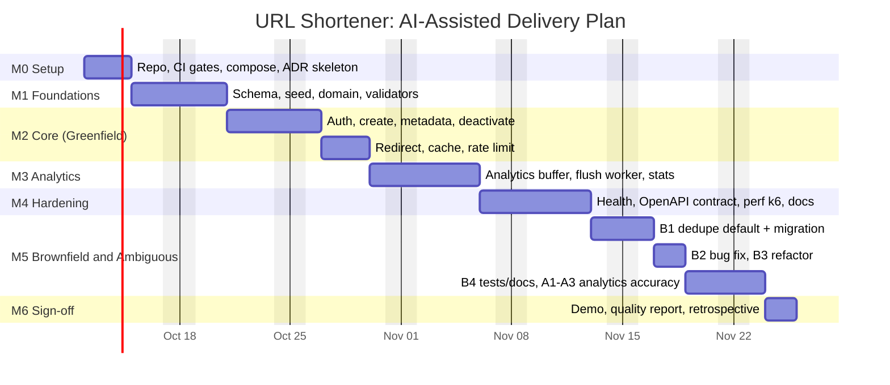

| Milestone | Target date | Exit criteria | Human sign-off |
|---|---|---|---|
| M0 Setup | 2026-10-14 | CI pipeline with gates G1–G10 running on an empty app | Tech lead approves pipeline |
| M1 Foundations | 2026-10-20 | V1 migration and seed applied; validator tests green | **Migration approval** |
| M2 Core | 2026-10-29 | CUJ-1, CUJ-2 and CUJ-3 (minus stats) pass; `demo.sh` partial | PR reviews |
| M3 Analytics | 2026-11-05 | Clicks flow end to end; stats match seed | PR reviews |
| M4 Hardening | 2026-11-12 | All P0 tests green, k6 meets NFR-1, runbook and scaling docs ready. **Working prototype complete.** | Release-gate review |
| M5 Scenarios | 2026-11-23 | B1–B4 and A1–A3 merged with evidence trails | **Migration (B1) + contract (A2) approval** |
| M6 Sign-off | 2026-11-25 | Quality report (§9.3), demo recorded, retrospective on AI usage | Tech lead + product owner |

---

## 15. Artifacts

| Artifact | Location | Produced in | Owner |
|---|---|---|---|
| PRD | `docs/prd-url-shortener.md` | Done | Product + engineering lead |
| Detailed design (this document) | `docs/design-url-shortener.md` | Done | Engineering lead |
| ADRs 0001–0010 (302 redirect, API-key auth, no default dedupe, local cache, click buffer, IP hashing, UTC days, rate-limit algorithm, readiness policy, analytics accuracy) | `docs/adr/` | M0–M5 | Engineering lead |
| Schema and seed | `src/main/resources/db/**` | M1 | Engineering lead (tech lead approves) |
| OpenAPI spec | `/openapi.json`, `openapi-baseline.json` | M4 | Engineering lead |
| Test suites and reports (JaCoCo, Surefire, PIT) | `target/site/**` (CI artifacts) | Continuous | Engineering lead |
| Performance reports | `docs/perf/` | M4, then nightly | Engineering lead |
| Runbook, scaling guide | `docs/runbook.md`, `docs/scaling.md` | M4, B4 | Engineering lead |
| AI usage log | `docs/ai-usage-log.md` | Every AI-assisted PR | Engineer of record |
| Demo script | `scripts/demo.sh` | M4 | Engineering lead |
| Quality report | `docs/quality-report.md` (from §9.3) | M6 | Engineering lead |

---

## 16. Assumptions, Limitations and Deviations from the PRD

### 16.1 Assumptions
1. Java 21 and Docker are available on developer machines. Maven Wrapper is committed.
2. One instance in the prototype. Multi-instance correctness gaps are documented (§12.1).
3. The PRD assumptions A3 (case-sensitive codes), A5 (normalisation), A6–A10 and A13 are adopted unchanged.
4. Country is not resolved in the MVP (`null`). Seed data includes countries so `top_countries` can be shown.
5. API keys are provisioned by operators with `create-api-key.sh`; there is no self-service flow.
6. The client IP is `remoteAddr` unless a trusted proxy is configured.
7. The 6-week timeline assumes one engineer with AI assistance and review turnaround within one business day.

### 16.2 Limitations
- **DB credentials are ignored for local runs** (`POSTGRES_HOST_AUTH_METHOD=trust`), per instruction. This is acceptable only on a developer machine. The datasource already reads `SPRING_DATASOURCE_PASSWORD`, so adding credentials later is a configuration change, not a code change.
- No TLS termination (local HTTP only).
- In-process cache and rate limiter are per instance (§12.2).
- Click loss on crash is bounded by the buffer contents.
- Stats run on raw events, so they are not suited to millions of clicks per link without rollups (§13.4).
- `/actuator/prometheus` is unauthenticated locally.
- There is no endpoint to list links (PRD OQ-2) or reactivate them (OQ-1).

### 16.3 Deviations from the PRD (decisions needing PRD owner acknowledgement)

| PRD item | PRD text | This design | Reason |
|---|---|---|---|
| FR-3.4, NFR-4.3, FR-8.2 | Redis cache and rate-limit store, `/readyz` checks Redis | **Caffeine in-process**, `/readyz` checks DB only | User asked for a simple Spring + Postgres prototype. Resolves PRD OQ-6. Redis is the scale path behind the same interfaces. |
| FR-3.4 | Cache TTL 24 h | **10 min** | Bounds cross-instance staleness without shared invalidation |
| NFR-5.2 | "Type-checked, strict mode" | `javac -Xlint:all -Werror` + SpotBugs | Java equivalent of a strict type checker |
| FR-7.8 | GeoIP lookup | Deferred (P2) | No external dependency in the prototype |
| OQ-9 | Load-test tool undecided | **k6**, profile in §8.6 | Resolved here |
| FR-1.4 | Dedupe with alias | Dedupe **ignored** when an alias is given | An explicit alias is a request for that specific code |

---

## 17. Appendix: Traceability Matrix

| PRD ID(s) | Design section(s) | Main classes | Main tests |
|---|---|---|---|
| URL-FR-1.1–1.7 | §3.3, §3.4, §4.5, §5.3, §6.2 | `LinkService`, `LinkValidator`, `LinkRepository` | `LinkApiIT.fr1_*`, `LinkServiceTest.fr1_*` |
| URL-FR-2.1–2.4 | §3.3, §4.3, §6.2 | `LinkValidator`, `LinkRepository` | `LinkValidatorTest.fr2_*`, concurrency test |
| URL-FR-3.1–3.7 | §3.5, §5.3, §6.3, §6.8 | `RedirectService`, `RedirectController`, `CaffeineLinkCache`, `CaffeineRateLimiter` | `RedirectApiIT`, `RedirectDegradationIT` |
| URL-FR-4.1–4.3 | §3.2, §3.3 | `Link.effectiveStatus`, `LinkValidator` | `LinkTest.fr4_3_*`, `LinkValidatorTest.fr4_2_*` |
| URL-FR-5.1–5.3, 6.1–6.3 | §6.5, §6.6 | `LinkService`, `LinkController` | `LinkApiIT.fr5_*`, `fr6_*` |
| URL-FR-7.1–7.7 | §3.6, §4.5, §6.3, §6.4, §6.7 | `ClickBuffer`, `ClickFlushWorker`, `StatsService`, `BotDetector`, `IpHasher` | `ClickPipelineIT`, `StatsApiIT`, `ClickFlushWorkerTest` |
| URL-FR-8.1–8.2 | §6.8 | `HealthController` | `HealthIT` |
| URL-NFR-4.x | §3.1, §3.3, §9.5, §10.4, §12 | Filters, `ApiKeyService`, `IpHasher` | `ApiKeyAuthFilterTest`, `BodySizeLimitFilterTest` |
| URL-NFR-5.x | §1.3, §8, §9 | Package structure | `LayeringArchTest`, JaCoCo gate |
| URL-NFR-6.x | §13.4 | Ports: `LinkCache`, `ClickSink`, `RateLimiter` | Documentation review |
| URL-OBS-1–3 | §6.9, §9.4, §9.5 | `RequestIdFilter`, `ClickFlushWorker` | Log-capture tests, shutdown test |
| URL-TEST-1–3, URL-DOC-1–2 | §7, §8, §15 | – | `check-traceability.sh`, contract test |
| URL-AI-1–6, URL-SCN-* | §10, §11 | – | PR template, CODEOWNERS, `ai-usage-log.md` |
